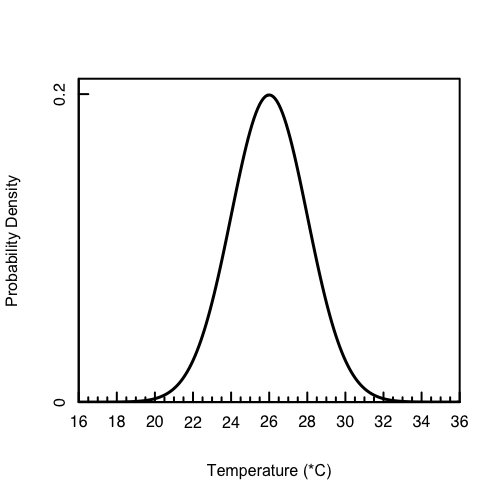
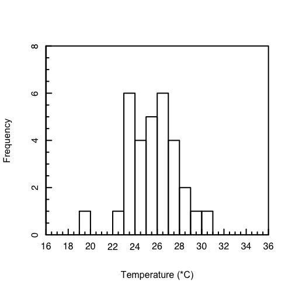

<a class="quicklink" href="https://github.com/alphonse/alphonse.github.io/raw/master/chem370/pdf/assignments/week03.pdf" target="blank">Download PDF of Assignment</a>
<a class="quicklink" href="https://github.com/alphonse/alphonse.github.io/raw/master/chem370/pdf/assignments/week03_key.pdf" target="blank">Download PDF of Answer Key</a>

<!-- Name: ___________________________________ -->

# Introduction

This assignment covers Chapters 3 and 4 of [*Analytical Chemistry 2.1*](https://chem.libretexts.org/Bookshelves/Analytical_Chemistry/Book%3A_Analytical_Chemistry_2.1_(Harvey)/02%3A_Basic_Tools_of_Analytical_Chemistry) by Harvey involving basic analytical chemistry terms, statistical analysis, and confidence intervals.

*You should work in groups to complete this activity.* Remember to maintain physical distance even when working in groups!  

# Types of Error

# Choosing a Method

Choosing a method to analyze a particular analyte in a particular matrix is an essential skill for any analytical chemist.  There are many factors go into this decision, and often there is more than one 'correct' answer.

> When choosing a method, a chemist will consider many factors including sensitivity, selectivity, interferences, robustness, ruggedness, cost, and availability.

1. An analyst needs to evaluate the potential effect of an interferent, I, on the quantitative analysis for an analyte, A. She begins by measuring the signal for a sample in which the interferent is absent and the analyte is present with a concentration of 15 ppm, obtaining an average signal of 23.3 (arbitrary units). When she analyzes a sample in which the analyte is absent and the interferent is present with a concentration of 25 ppm, she obtains an average signal of 13.7.

      1. What is the sensitivity for the analyte?

            <!-- \vspace{1cm} -->

      1. What is the sensitivity for the interferent?

            <!-- \vspace{1cm} -->

      1. What is the value of the selectivity coefficient?

            <!-- \vspace{1cm} -->

      1. Is the method more selective for the analyte or the interferent?
      
            <!-- \vspace{1cm} -->

1. Examine a procedure from *Standard Methods for the Analysis of Waters and Wastewaters* (or another manual of standard analytical methods) and identify the steps taken to compensate for interferences, to calibrate equipment and instruments, to standardize the method, and to acquire a representative sample.

# Characterizing Data

When describing data, we use *measures of central tendency* to describe the value the data tend toward and *measures of spread* to describe the variability in the data.

> Chemists usually use the **mean** as a measure of spread.  When a mean represents a set of measurements we call it the *sample mean*, $\bar{x}$; when it represents every possible measurement, we call it the *population mean*, $\mu$.  All chemical measurements determine $\bar{x}$:
>
> $\bar{x} = \frac{\sum_{i=1}^{N} x_i}{N}$
>
> where $N$ is the number of data points, $x_i$.
>
> Chemists usually use the **standard deviation** (SD) as a measure of spread.  It has the same units as the mean.  When a SD represents a set of measurements we call it the *sample SD*, $s$; when it represents every possible measurement, we call it the *population SD*, $\sigma$.  All chemical measurements determine $s$:
>
> $s = \sqrt{\frac{\sum_{i=1}^{N} (x_i - \bar{x})^2}{N-1}}$

1. A determination of acetaminophen in 10 separate tablets of Excedrin Extra Strength Pain Reliever gives the following results (in mg): 224.3, 240.4, 246.3, 239.4, 253.1, 261.7, 229.4, 255.5, 235.5, 249.7.

      1. Report the mean, median, range, standard deviation, and variance for this data.

            <!-- \vspace{2cm} -->

      1. Assuming that  $\bar{x}$  and $s^2$ are good approximations for $\mu$ and for  $\sigma^2$ , and that the population is normally distributed, what percentage of tablets contain more than the standard amount of 250 mg acetaminophen per tablet?

            <!-- \vspace{2cm} -->

      *The data in this problem are from Simonian, M. H.; Dinh, S.; Fray, L. A.* Spectroscopy ***1993***, *8(6), 37–47.*

1. The normal distribution below represents the theoretical daily high temperatures for the month of August in Altamont.  The population mean is $\mu$ = 26$^{\circ}$C and the population standard deviation $\sigma$ = 2$^{\circ}$C.  
      
      1. What percentage of days would you expect to have a high between 24$^{\circ}$C and 28$^{\circ}$C?
      
            <!-- \vspace{1cm} -->
            
      1. What percentage of days would you expect to have a high between 28$^{\circ}$C and 32$^{\circ}$C?
            
            <!-- \vspace{1cm} -->

      

# Confidence Intervals

When comparing data, we must be certain the differences are *significant*.  Chemists use *confidence intervals* to determine significance.  If the confidence intervals do not overlap, the measurements are significantly different.

> A confidence interval is calculated at a predetermined level of certainty, for example 95% (or $\alpha$ = 0.05).  A measurement is always reported with the confidence interval:
>
> value = $\bar{x} \pm \text{CI} = \bar{x} \pm t \frac{s}{\sqrt{N}}$
>
> where $t$ comes from a $t$-table.

1. The *histogram* below shows the measured daily high temperatures for the month of August in Altamont for the year 2020. For this data, $\bar{x}$ = 25.6$^{\circ}$C and $s$ = 2.23$^{\circ}$C. An observation was made on every day of August.  What range of temperatures can you be 95% certain any given daily high would fall within?

      

1. Gacs and Ferraroli reported a new method for monitoring the concentration of SO$_2$ in air. They compared their method to the standard method by analyzing urban air samples collected from a single location. Samples were collected by drawing air through a collection solution for 6 min. Shown here is a summary of their results with SO$_2$ concentrations reported in $\mu$L m$^{-3}$. Using an appropriate statistical test, determine whether there is any significant difference between the standard method and the new method at  $\alpha$ = 0.05.  

| Standard Method | New Method |
|:---------------:|:----------:|
|      21.62      |   21.54    |
|      22.20      |   20.51    |
|      24.27      |   22.31    |
|      23.54      |   21.30    |
|      24.25      |   24.62    |
|      23.09      |   25.72    |
|      21.02      |   21.54    |

*The data in this problem are from Gacs, I.; Ferraroli, R.* Anal. Chim. Acta ***1992***, *269, 177–185*.

# Outlier Detection

# Propagation of Uncertainty

1. Which of the following is the best way to dispense 100.0 mL if we wish to minimize the uncertainty: (a) use a 50-mL pipet twice; (b) use a 25-mL pipet four times; or (c) use a 10-mL pipet ten times?

1. The formula weight (FW) of a gas can be determined using the following form of the ideal gas law:

      $$
      FW = \frac {g \text{R} T} {P V} \nonumber
      $$

      where $g$ is the mass in grams, $R$ is the gas constant, $T$ is the temperature in Kelvin, $P$ is the pressure in atmospheres, and $V$ is the volume in liters. In a typical analysis the following data are obtained (with estimated uncertainties in parentheses):

      - $R = 0.082056 \text{ L atm mol}^{–1} \text{K}^{-1} (\pm 0.000001 \text{ L atm mol}^{–1} \text{K}^{-1})$
      - $T = 298.2 \text{ K } (\pm 0.1 \text{ K})$
      - $P = 0.724 \text{ atm } (\pm 0.005 \text{ atm})$
      - $V = 0.250 \text{ L } (\pm 0.005 \text{ L})$

      1. What is the compound’s formula weight and its estimated uncertainty?

      2. To which variable(s) should you direct your attention if you wish to improve the uncertainty in the compound’s molecular weight?

<!-- \vfill -->
 
 
 -----------
*The activities here are based on, and many are reprinted directly from, Analytical Chemistry 2.1 by David Harvey.  That text, and this work, are licensed under the Creative Commons Attribution-NonCommercial-ShareAlike License [4.0](https://creativecommons.org/licenses/by-nc-sa/4.0/). Under the conditions of this copyright you are free to share this work with others, either electronically or in print. You also are free to remix or adapt the work, provided that you attribute the original work and author and that you distribute your work under the same or similar license. You may not use this work for commercial purposes.*
