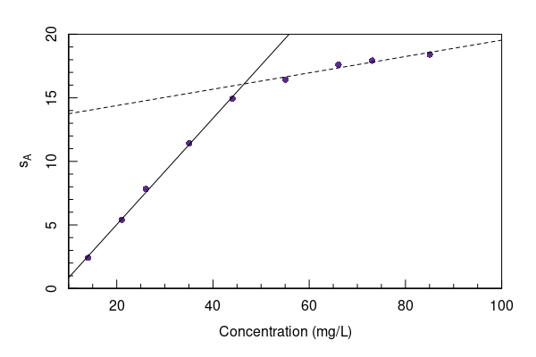

<a class="quicklink" href="https://github.com/alphonse/alphonse.github.io/raw/master/chem370/pdf/assignments/week04.pdf" target="blank">Download PDF of Assignment</a>

<!-- Name: ___________________________________ -->

# Introduction

This assignment covers Chapters 4 and 5 of [*Analytical Chemistry 2.1*](https://chem.libretexts.org/Bookshelves/Analytical_Chemistry/Book%3A_Analytical_Chemistry_2.1_%28Harvey%29/05%3A_Standardizing_Analytical_Methods) by Harvey involving basic analytical chemistry terms, statistical analysis, and confidence intervals.

# Lower Limit of Detection

1. The first plot below of signal vs. time was acquired by measuring the baseline (blank) signal from an instrument under development.  It was acquired with a signal averaging time of 1 second (sampling rate = 1 Hz).  What is the minimum detectable signal level for this instrument?

    <!-- \vspace{2cm} -->

1. The second plot below shows data from the same instrument, but with a signal averaging time of 10 seconds (sampling rate = 0.1 Hz).  What is the minimum detectable signal in this case?

    <!-- \vspace{2cm} -->

1. What causes the difference observed when the averaging time changes?

    <!-- \pagebreak -->

<!--  -->

<!-- \pagebreak -->

# Limits of Quantitation

1. The attached calibration curve is for the same instrument described above.  What is the minimum *detectable* concentration?

    <!-- \vspace{2cm} -->

1. What faction of the detected signal is actually due solely to random noise and not true signal?

    <!-- \vspace{2cm} -->

1. What is the minimum *quantifiable* concentration?

    <!-- \vspace{2cm} -->

1. What is the maximum quantifiable concentration?

    <!-- \vspace{2cm} -->

1. What is the linear dynamic range (LDR) of the instrument?

    <!-- \vspace{2cm} -->

<!--  -->

| Conc (mg/L) | s$_A$ |
|:-----------:|:-----:|
|    14.07    | 2.406 |
|    21.05    | 5.401 |
|    26.04    | 7.825 |
|    35.07    | 11.43 |
|    44.09    | 14.93 |
|    55.05    | 16.44 |
|    66.09    | 17.60 |
|    73.10    | 17.93 |
|    85.05    | 18.41 |

<!-- \vfill -->
 
 --------------
 
*The activities here are based on, and many are reprinted directly from, Analytical Chemistry 2.1 by David Harvey.  That text, and this work, are licensed under the Creative Commons Attribution-NonCommercial-ShareAlike License [4.0](https://creativecommons.org/licenses/by-nc-sa/4.0/). Under the conditions of this copyright you are free to share this work with others, either electronically or in print. You also are free to remix or adapt the work, provided that you attribute the original work and author and that you distribute your work under the same or similar license. You may not use this work for commercial purposes.*
