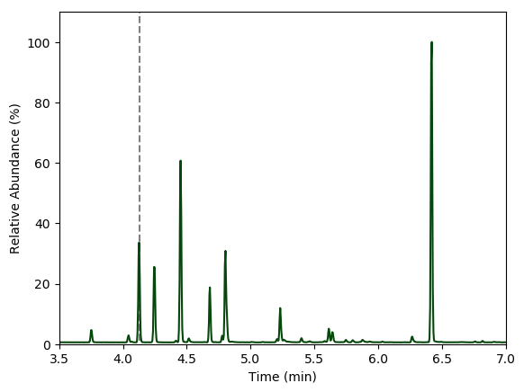
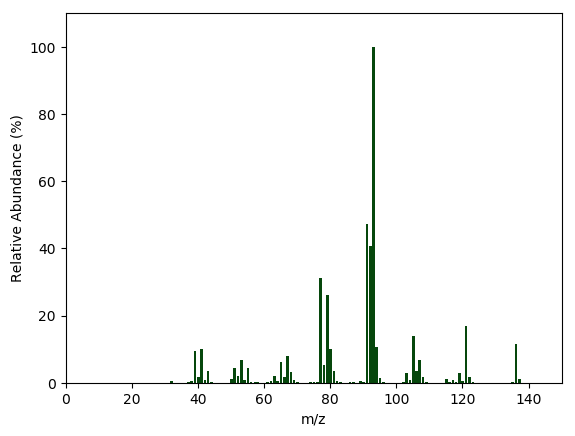
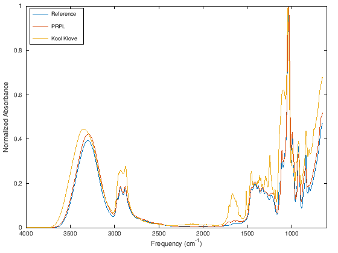

# {-}

<center>

 of mass spectrometer.](images/cover-image-mass-spec.png)

<small>

Copyright 2020 Al Fischer

<a rel="license" href="http://creativecommons.org/licenses/by-nc-sa/4.0/"></a><br />This work is licensed under a <a rel="license" href="http://creativecommons.org/licenses/by-nc-sa/4.0/">Creative Commons Attribution-NonCommercial-ShareAlike 4.0 International License</a>.

</small>


</center>

<!--chapter:end:index.Rmd-->

# (PART) Introduction {-}

# Getting Started in R

##### **Objective** | Become familiar with Markdown and install R + RStudio on your computer {-}

##### **To Turn In**  {-}

This Lab will be completed on the honor system.  You must complete the following activities before Week 2 or you will not be able to participate in lab.

- [Markdown Tutorial](https://www.markdowntutorial.com/)
- Install R + RStudio + `chem370learnR` package
- Create a Lab Notebook Template for Lab 1

##### **Student Learning Outcomes** | *By the end of this lab, students will:*   {-}

  - Familiarize themselves with Markdown syntax.
  - Create a working installation of R + RStudio on their computer.
  - Understand how to create a lab notebook template in RStudio.

## Introduction {#r-intro -}

Chem 370 lab will make extensive use of electronic lab notebooks.  We'll use two tools to achieve a robust electronic lab notebook: (1) **R Markdown Notebooks**, (2) the **R** programming language, and (3) the [RStudio](https://www.google.com/url?sa=t&rct=j&q=&esrc=s&source=web&cd=&cad=rja&uact=8&ved=2ahUKEwictpuN2IvqAhVtl3IEHUhSCUUQFjAAegQIAhAC&url=https%3A%2F%2Frstudio.com%2F&usg=AOvVaw2mM_qCjo878d2q5bcC0XUS) integrated development (IDE, a tool that will make it easier to use items 1 and 2).  The R Markdown (RMD) notebook provides a place to write everything that would normally go in your lab notebook, but is entirely electronic.  The R language is used to process data in a fashion similar to Excel, except that all actions are done by issuing commands rather than through a graphical interface.  Importantly, this configuration allows all of the data processing steps and data files you have in electronic form to be displayed directly in your lab notebook!  You'll learn more about what these software are as you complete this lab activity.

The configuration described above requires the R language and the RStudio IDE.  These are both freely available online for Windows, Mac OSX, and Linux.  You have several options when using the software: (1) You may install R and RStudio directly on your personal computer (recommended) or (2) use R and RStudio through WCU’s VCAT interface (might be useful as a backup if your computer isn't cooperating). 

Know up front that learning to program can be a daunting experience and takes time to learn.  You'll experience many occasions in which your code won't run, and you'll have to figure out why.  This can be frustrating at times, and you may often feel lost.  But programming can also be very rewarding once you start to get the hang of it!  To help with your transition into the world of programmatic data analysis, you'll be provided with several forms of tutorials.  Some will be built directly into RStudio, and you'll be able to access them after installing the Chem 370 add-on package; others will be in the form of video tutorials in which I'll walk you through various steps of installing the software, navigating it, and processing your data.

Your goals for this lab are to become familiar with the Markdown syntax, install R and R+Studio on your computer, and then create a lab notebook template using R Markdown that you'll use to record details and data next week in lab (so make sure you bring your computer next week!).

## Learning Markdown {#learning-markdown -}

**Markdown** is a markup language that was developed by John Gruber and Aaron Swartz in the mid-2000's.  It provides a simple, streamlined utility for word processing and web page creation.  It's been adopted in many places, which numerous websites, message boards, blogs, and even all the materials for this course being written in Markdown.  In essence, the writer creates a plain text document (extension: `.txt` or `.md`) and uses software to render the Markdown into a nicely formatted document (originally just HTML (web format), but now there's support for PDFs, Word Docs, and more).  The language is quite simple; if you can use Word, you can easily use Markdown.  The tutorial linked below will help you get started.

- **TASK:** Complete the [Markdown Tutorial](https://www.markdowntutorial.com/)

## Installing R + RStudio {#install-r -}

**R** is the programming language we'll use to process data this semester.  We'll discuss more of the details about what R is and why we're using it in a few weeks.  For now we just need to get it installed and create a basic Markdown document.  **RStudio** is a peice of software called an *integrated development environment* (IDE) that provides a unified interface for all the tools we need to use R.  It is ***highly*** recommended that you use RStudio to interact with R.  The steps below will walk you through installing both of them.

### Install R (Must be done first) {-}

1. Open a web browswer and navigate to the [Duke University R Mirror](http://archive.linux.duke.edu/cran/) and click the link for your operating system (Windows, Mac OSX, Linux).  
2. Follow the on-screen prompts to install R (will vary by operating system).

### Install RStudio {-}

1. *Once you've successfully installed R*, navigate to the [RStudio downloads page](https://rstudio.com/products/rstudio/download/#download) and click the link to download the version that matches your operating system.  
2. Follow the on-screen prompts to install RStudio (will vary by operating system).

### Installing the CHEM 370 Package {#installing-c370-package -}

One of the great things about R is that anyone can develop add-ons (called "packages") for it.  I've developed a package for Chem 370 that has functions and tutorials specifically for this class.  You'll need to install it to follow along with the tutorials.

1. Once you've installed R and RStudio, you open up RStudio (opening RStudio also opens an R session automatically).  
1. Install the `devtools` package, which will make it easier to install the Chem 370 package.
    1. In RStduio, navigate to the **Packages** tab in the lower right pane and click **Install**.
    1. In the dialog that opens, type in `devtools` on the *Packages* line.
    1. Click **Install**.
1. *Install the `chem370learnR` package*: In Rstudio, find the **Console** tab in the lower left pane.  Copy and paste the following lines *exactly*:
      
      ```{r eval=F}
      using(devtools)
      install_github("github URL for package")
      ```
      
The `chem370learnR` package should now be installed on your system.

## Creating a Lab Notebook Project {#create-lab-notebook -}

***VIDEO TUTORIAL***

### Create a Project {-}

In this step, you'll create an R "project" for lab 1.  The project will help keep all your files for lab 1 organized.  You should create a separate project for each lab.

1. In RStudio, click the **Project: (none)** button in the top corner and then click **New Project...*
1. Choose **New Directory** and **New Project**.
1. Type in **Lab 1: UV-vis** in the *Directory name* line.  In the *Create project as subdirectory of:* box choose **Browse**.  Then:
    1. Navigate to your `Documents` folder (or another directory if you prefer to save your notebooks somewhere else).
    1. Create a **New Directory**/**New Folder** and call in **`lab-notebooks`**.
    1. Click OK to exit the dialog.  The path should be set to something like `~/Documents/lab-notebooks` (may vary slightly depending on your OS).
1. Click **Create Project**.  You'll see that project icon in the top right corner now read **Project: Lab 1: UV-vis**.

### Create a Notebook File {-}

1. Load the Chem 370 learnR package: Go to the **Packages** tab in the bottom right pane and check `chem370learnR` on.  You should load this package everytime you start R.
1. In the top left corner, click the **New File** icon and choose **R Markdown**.
1. In the new window that opens, choose **From Template** (left side) and then **Chem 370 Lab Notebook**. Enter ***lab1_uv-vis*** for the title (i.e. filename) and your name for the author.  Make sure the output is set to HTML and click **OK**.  Use this format for all your lab notebooks this semester.
1. The notebook document is populated with a bare bones template for use in lab.  Fill in a title and your name, and write and introduction before lab next week.

<!--chapter:end:00_R.Rmd-->

# Overview {-}

This course is an introduction to instrumental analysis in the chemistry lab. Students will be introduced to components of the “analyst’s toolbox” through real-world scenarios, including spectroscopy, mass spectrometry, and chromatography. Students will conduct sample preparation, instrument calibration, and qualitative and quantitative analysis using UV-visible spectroscopy (UV-vis), gas-chromatography/mass spectrometry (GC-MS), high-performance liquid chromatography (HP-LC), flame atomic absorption spectroscopy (FAAS), and Fourier-transform infrared spectroscopy (FT-IR). Throughout the semester, students will also work to develop skills related to reproducible data analysis, scientific communication, and collaboration in the laboratory. Prerequisites include CHEM-232 (Quantitative Analysis) and CHEM-242 (Organic Chemistry II).

## Lab Activities {-}

Students will work in pairs at the beginning of the semester to complete introductory labs involving spectroscopy and gas chromatography.  After that, they will be assigned groups of 2-3 with which they will complete one rotation lab that lasts the remainder of the semester.  Students may choose to analyze [e-cigarette liquid](/devel/chem370/lab-manual/rotation-a-e-cigarette-liquid.html) or [acetaminophen tablets](/devel/chem370/lab-manual/rotation-b-acetaminophen.html) for their rotation lab.  The rotation lab are scenario-based, so students should refer to the memorandum at the beginning of each rotation for details.  The lab activities for the rotation lab are:

| Vape Juice                             | Acetaminophen                               | 
| -------------------------------------- | ------------------------------------------- |
| GC-MS (ID flavor)                      | HPLC (Quantify acetaminophen, check purity) |
| AA (Quantify Metal)                    | FTIR (Check for Adulterants)                |
| FTIR (Check for Adulterants)           | GC-MS (ID flavor)                           |
| HPLC (Quantify Nicotine, check purity) | AA (Quantify Metal)                         |

## Lab Notebooks {-}

Students will use [Jupyter Lab](https://jupyter.org/) as an electronic lab notebook together with [Octave (or MATLAB)](https://www.gnu.org/software/octave/) for data processing.  Octave is an open-source programming language that is largely modeled after MATLAB, one of the most commonly used programming languages in the fields of chemistry, physics, and engineering.  In general, MATLAB code will usually run in Octave.  So if you get stuck in Octave, you can usually find MATLAB examples that will help solve your problem.  More information on these software packages can be found in the [appendices](/devel/chem370/lab-manual/appendix-1-getting-started-in-octave-and-jupyter-lab.html).

## Features of the Book {-}

### **Typographical Conventions** {-}

This lab manual will use some common typographical (formatting) conventions to distinguish between its different features.   For example, the data processing activities will make extensive use of [Octave (MATLAB)](https://www.gnu.org/software/octave/) code, which will always be represented with `monospace font with a grey background` (in the online version).  It may be `inline` or

```
offset.
```

You should take time to thoroughly digest code chunks.  Sometimes the code may work as-is; other times you may have to add to the code or change placeholders to make it work.  And other times the code may be *pseudocode*, which is example code that looks like it would work but will throw an error.  The code will often be color-coded to highlight various features of the programming language (a feature called syntax highlighting).

The lab procedures will often contain warnings that your should watch out for.  

   > A warning will look like this!

It also contains checkpoints and tips to help keep you on track.  
```{marginfigure}
A tip or checkpoint will look like this.
```


<!-- Both in code and in the lab manual text, capital letters will be used to represent matrices and lowercase letters will be used to represent vectors and scalars.  Matrices and vectors will always be bold within the text.  For example:

- `A` or **A** represents a matrix
- `a` or **a** represents a vector
- `a` or $a$ represents a scalar. -->

### **e-Book vs. PDF** {-}

This lab manual is available in both HTML (webpage) format and as a PDF.  These two formats generally have identical content, although some features of the book (such as videos) may only work in the online version and do not appear in the PDF.

<!-- ### Additional Resources {-} -->

<!-- ##### **Octave/MATLAB** {-} -->

<!-- - [MATLAB Cheat Sheet](http://assets.steventhornton.ca/A_Matlab_Cheat_Sheet/MatlabCheatsheet.pdf) (PDF) -->
<!-- - [MATLAB Support - Examples](https://www.mathworks.com/help/examples.html)   -->
<!-- - [Octave Wikibook](https://en.wikibooks.org/wiki/Octave_Programming_Tutorial) -->
<!-- - [Jupyter Docs](https://jupyterlab.readthedocs.io/en/stable/) -->

<!-- ##### **Analytical Chemistry** {-} -->

<!-- - **Recommended Supplementary Book:** Harvey, D.T. (2008) *[Analytical Chemistry 2.0](http://dpuadweb.depauw.edu/harvey_web/eTextProject/version_2.0.html)* (free online) -->

<!-- ##### **Markdown** {-} -->

<!-- - [Markdown Tutorial](https://www.markdowntutorial.com/) -->
<!-- - [Markdown Resources](https://www.markdowntutorial.com/conclusion/) -->

<!--chapter:end:00C_preface.Rmd-->

# Syllabus {-}

**Instructor:** Al Fischer, PhD  
**Office Hours:** By appointment at [calendly.com/drfischer](http://www.calendly.com/drfischer)  (NS 209)  
**Availability:** See my calendar at [alphonse.github.io/contact]({{site.baseurl}}/contact)  
**Email:** [dfischer@wcu.edu](mailto:dfischer@wcu.edu)

### Overview {-}

This course is an introduction to instrumental analysis in the chemistry lab.  Students will be introduced to components of the “analyst’s toolbox” through real-world scenarios, including spectroscopy, mass spectrometry, and chromatography.   Students will conduct sample preparation, instrument calibration, and qualitative and quantitative analysis using UV-visible spectroscopy (UV-vis), gas-chromatography/mass spectrometry (GC-MS), high-performance liquid chromatography (HP-LC), flame atomic absorption spectroscopy (FAAS), and Fourier-transform infrared spectroscopy (FT-IR).  Throughout the semester, students will also work to develop skills related to reproducible data analysis, scientific communication, and collaboration in the laboratory.  Prerequisites include CHEM-232 (Quantitative Analysis) and CHEM-242 (Organic Chemistry II).

### Student Learning Outcomes {-}

To achieve a satisfactory grade, students will:

1. Relate a theoretical, mechanical, and practical understanding of chemical instrumentation.

1. Combine concepts from Quantitative Analysis, Organic Chemistry, and General Chemistry with instrumental theory and programmatic data analysis to demonstrate accurate, reproducible qualitative and quantitative analysis of complex samples.

1. Communicate analysis questions, methods, results, and conclusions using written word, pictorial figures, and data tables.

1. Participate effectively in group projects.

1. Demonstrate safe laboratory practices.

1. Critically evaluate peer work.

### Required Course Materials {-}

**Text Book:**  Granger, R. M., Yochum, H. M., Granger, J. N., & Sienerth, K. D. (2017). *Instrumental Analysis*. Oxford University Press. (WCU rental book available at bookstore)

**Lab Manual:** Fischer, D.A. (2020) *[Chem 370 Lab Manual]({{site.baseurl}}/devel/chem370/lab-manual)* (free online)

**Technology:** Students will need a laptop computer meeting Chemistry and Physics' [minimum computer requirements](https://www.wcu.edu/learn/academic-services/it/computer-guidelines/index.aspx).   Students will be required to install [Juno + Julia](https://junolab.org/) on their computer.  A web browser and internet connection capable of streaming video will be necessary for submitting homework assignments and accessing course materials.

**Additional Required Course Materials:**  

  - Goggles rated for chemical protection
  - Nitrile gloves
  -	Appropriate clothing: closed-toed shoes, long pants, hair tie for long hair
  -	Permanent, felt-tipped marker (e.g. a Sharpie®)
  - A laptop computer meeting Chemistry and Physics' [minimum computer requirements](https://www.wcu.edu/learn/academic-services/it/computer-guidelines/index.aspx).

Most materials are available from the WCU bookstore; goggles are also available from the WCU Chemistry Club (recommended).  A lab coat is optional.

### Lab Notebooks and Data Analysis {-}

Lab notebooks will be completed electronically either using Jupyter and Octave or using MATLAB Live Notebooks.  Students will be required to submit their data files along with their lab notebooks so that they can be checked for accuracy.  A lab notebook that does not compile will not be graded.

<!-- Lab notebooks will be completed electronically in Lab Archives and data analysis will be done in Microsoft Excel.  Alternatively, students may choose to learn a programming language (Python) and complete their lab notebooks in Jupyter for extra credit.  If a student chooses programming, a total of 100 points extra credit will be added to SLO 2, above.  Students must complete *all* lab work in Jupyter for extra credit -- no partial extra credit will be awarded.  However, students will have a 2-week grace period to choose. -->

### Grading {-}

**Grading Methods**

Your grade is tied directly to the student learning outcomes for the course.  Each SLO will be assessed as below.  Each assignment will be categorized by SLO and used to assess your progress in achieving that objective.  Your final grade will be determined by calculating the weighted average (out of 100) across all SLOs using the weightings listed in parentheses. If you are unsure how to calculate your grade please ask your instructor.

1. (25%) Relate a theoretical, mechanical, and practical understanding of chemical instrumentation.
     - Assessed by written quizzes and/or face-to-face examinations.
1. (25%) Combine concepts from Quantitative Analysis, Organic Chemistry, and General Chemistry with instrumental theory and programmatic data analysis to demonstrate accurate, reproducible qualitative and quantitative analysis of complex samples.
     - Assessed by inspection of lab notebooks for accuracy, thoroughness, and data quality.
1. (25%) Communicate analysis questions, methods, results, and conclusions using written word, pictorial figures, and data tables.
     - Assessed by peer and instructor review of technical reports for accuracy and clarity.
1. (10%) Participate effectively in group projects.
     - Assessed by peer and instructor evaluation.
1. (10%) Demonstrate safe laboratory practices.
     - Assessed by an ability and willingness to follow standard safety protocols.
1. (5%) Critically evaluate peer work.
     - Assessed by participation in peer-review exercises.

<!-- \pagebreak -->

**Grading Scale**

| Number Range | Letter Grade |
|:------------:|:------------:|
|    97-100    |      A+      |
|   93-96.9    |      A       |
|   90-92.9    |      A-      |
|   87-89.9    |      B+      |
|   83-86.9    |      B       |
|   80-82.9    |      B-      |
|   77-79.9    |      C+      |
|   73-76.9    |      C       |
|   70-72.9    |      C-      |
|   67-69.9    |      D+      |
|   63-66.9    |      D       |
|   60-62.9    |      D-      |
|     <60      |      F       |

These grades indicate levels in quality from excellent to unsatisfactory.  Students are responsible for knowing class attendance, withdrawal, and drop-add policies and procedures.

**Submitting Assignments**

Most assignments will be submitted electronically.  Unless otherwise specified, assignments are due at 23:59:59 on the due date (usually the day before lab).  

 - A file submission URL or Blackboard submission folder will be provided for each assignment.  Assignments submitted through said URL are visible only by the instructor.
 - Students must provide their name via the file submission link to get credit.  For group assignments, put the group name in the submission fields instead; only one submission per group per assignment is necessary.
 - Files should be given a clear, logical filename that reflects the assignment name.
 - Files may be sorted automatically by a computer.  Therefore, any files not named appropriately, not in the specified format, or submitted elsewhere will either incur point deductions or not be graded.
 - Any electronic assignments turned in via hardcopy will not be graded.

Submissions that do not follow these guidelines may incur point deductions.

**Late Work**

Late work is not accepted in this course.  Due dates are automatically enforced by software.  However:  

- Assignments are accepted up to 7 days *early* and students are encouraged to submit assignments before the due date.  Extra credit of 5% per assignment is granted for assignments submitted more than 24 hours early!
- Each student is granted one exception to the late policy.  You must fill out a [late work exception form](https://forms.office.com/Pages/ResponsePage.aspx?id=WluzxdUWFESO4XvecFQ_GwFnoMNxJhxDhln9pQs53sVUOEMxSk9IWThGUExPNEEzTTlONTJXR1dSNS4u) to use your exception.  You may use this exception for any reason, but bear in mind future exceptions aren't guaranteed.  Exceptions cannot be used on pass/fail assignments.
- If you experience *extenuating circumstances* (e.g. a medical emergency, professionally diagnosed illness, or death in the family) or a [*university-sponsored absence*](https://www.wcu.edu/experience/health-and-wellness/student-concern-response-team/absence-notification-protocol.aspx) you may ask to be considered for an extension on a case-by-base basis.  Communication of the issue to your instructor and identification of when you plan to turn in the assignment are important in such circumstances.  For university-sponsored absences, exceptions should be arranged *before* your absence or will not be granted.

<!-- - Assignments worth less than 15 points (including pass/fail assignments) will not be accepted late.
- Lab reports and assignments worth more than 15 points will be accepted up to 7 calendar days after the due date with a deduction of 5 percent per day; no work will be accepted after 7 days (including weekends).  An exception to this rule occurs when the assignment is due on the last day/weekend before finals; these assignments will not be accepted late.
- For work that IS accepted late, a separate late submission link will be provided.  If no late submission link is provided the assignment is not accepted late. -->

**Grading Technology**

Some items may be graded by computer software.  Any answers not in the specified format will not be graded.  Written work may be checked for plagiarism using computer software.  Plagiarism will NOT be tolerated (see policies in *Fine Print*, below).  Due dates/times are computer-enforced.

### Course Policies {-}

**Classroom Expectations:** The shared learning space of the college classroom is built on respect for each other and each other’s learning. Learning together means our actions can intentionally and unintentionally distract others from their learning goals. As responsible learners who respect the rights of others and vow to minimize avoidable distractions such as: non-academic technology use, coming in late, sleeping, off-topic discussions, doing other homework, eating, etc.

***Proper Laboratory Attire:*** Students must arrive to lab wearing appropriate attire.  Students without appropriate attire will be asked to leave and will not be able to complete the activity for the day (and will be counted absent).

- Wear eye protection at all times (whenever you are in the room).  
- Wear closed-toed shoes that fully cover your feet up to the ankle at all times.  
- Wear long pants that extend over the top of your shoes at all times.  
- Wear a hair tie for long hair.  
- Never wear tank tops, sleeveless shirts, shorts, or sandals.  

***Laboratory Behavior:*** Never bring food or drink into the laboratory.  This includes sealed bottles and items inside backpacks – leave them outside the lab!  Do not chew gum, use tobacco products, or apply cosmetics in the lab.  Do not place personal items inside fume hoods or where they may come into contact with chemicals.  Keep walkways clear of chairs, bookbags, etc.  Wash your hands before leaving lab, and never wear gloves or lab coats outside the lab!

The sparing use of cell phones during lab sessions is permitted but discouraged. If you must, please use your cell phone outside the laboratory, and never leave an experiment unattended to do so!

In an effort to maintain a productive work environment for all students, please refrain from playing music, videos, etc., in the classroom.

***Pregnancy:*** Certain chemicals can have severe harmful effects on unborn children.  Any student who is pregnant or might have become pregnant and wished to avoid these hazards should notify her TA or instructor before conducting any laboratory work so that proper safety precautions can be taken.

**Attendance:** Please email your instructor *ahead of time* if you encounter circumstances that absolutely prevent you from making it to lab on time.  Attendance to all class periods is mandatory. Absences from group work sessions may incur a loss of points up to a zero for the assignment and deductions in the student's participation grade.  

**Inclement Weather:** Please check the University website for campus closings during times of bad weather.  Your safety is a priority when traveling. Use common sense when attempting to get to campus and notify your instructor if you are unable to safely make it.  Announcements will be made via e-mail if class must be cancelled when the University has not officially closed.

**Composition-Condition Marks:** Proper mastery of the English language will be considered when assessing written work. A student whose written work fails to meet acceptable standards will be assigned a composition-condition (CC) mark by the instructor on the final grade report. All undergraduates who receive two CC grades prior to the semester in which they complete 110 hours at WCU are so notified by the registrar and are required to pass English 300 or English 401 before they will be eligible for graduation. This course must be taken within two semesters of receiving the second CC and must be passed with a grade of C (2.0) or better. Students needing assistance with writing are encouraged to get help from WaLC. All written work submitted for this class may be checked with SafeAssign.

**Civil Discourse at Western Carolina:** Consistent with WCU’s core values and our campus creed, the WCU community accepts the freedoms and responsibilities of our shared community. WCU encourages all to clearly express their own views while at the same time seeking to understand the varieties of style, identity, and opinion that are held in any diverse community. In order for us to sustain a learning environment that promotes and values freedom of expression, we have a shared charge to accept personal responsibility for our actions, reactions, and speech, while seeking to learn from the actions, reactions, and speech of others.

<!-- Proper Laboratory Attire: Students must arrive to lab wearing appropriate attire. Students without appropriate attire will be asked to leave and will not be able to complete the activity for the day (and will be counted absent). Students who forget their goggles may “rent” a pair for a cost of 5 points subtracted from their grade.

- Wear goggles at all times (whenever you are in the room).
- Wear closed-toed shoes that fully cover your feet up to the ankle at all times.
- Wear long pants that extend over the top of your shoes at all times.
- Wear a hair tie for long hair.
- Never wear tank tops, sleeveless shirts, shorts, or sandals.

Laboratory Behavior: Never bring food or drink into the laboratory. This includes sealed bottles and items inside backpacks – leave them outside the lab! Do not chew gum, use tobacco products, or apply cosmetics in the lab. Do not place personal items inside fume hoods or where they may come into contact with chemicals. Keep walkways clear of chairs, bookbags, etc. Wash your hands before leaving lab, and never wear gloves or labcoats outside the lab! -->

<!-- Certain chemicals can have severe harmful effects on unborn children. Any student who is pregnant or might have become pregnant and wished to avoid these hazards should notify her TA or instructor before conducting any laboratory work so that proper safety precautions can be taken. -->

### Institutional Policies {-}

**Course Recording and Broadcasting:** Students may make visual or audio recordings (Recording) of any class related content, using any approved recording device (e.g., smart phone, computer, digital recorder, etc.) upon the **prior permission of the instructor** and subject to the following restriction(s). The Recording, along with the video capture of visible course materials (e.g., visible PowerPoint slides and/or visible lecture notes), shall be limited to the student’s personal, course related, educational use and shall be subject to all applicable copyright laws and institutional policies. The student may not transfer, transmit, or otherwise disseminate the Recording to any third party, including classmates, without the permission of the instructor. Any violation of these restrictions, or any other restriction verbally communicated by the instructor, may subject the student to the provisions of the WCU Academic Integrity Policy, the WCU Code of Student Conduct or both.

**Accommodations for Students with Disabilities:** Western Carolina University is committed to providing equal educational opportunities for students with documented disabilities and/or medical conditions. Students who require accommodations must identify themselves as having a disability and/or medical condition and provide current diagnostic documentation to the Office of Accessibility Resources. Please contact the Office of Accessibility Resources, 135 Killian Annex, (828) 227-3886, by [email](mailto:accessibility@wcu.edu), or at [http://accessibility.wcu.edu/](https://www.wcu.edu/learn/academic-services/disability-services/index.aspx).

**Academic Integrity Policy and Reporting Process:** This policy addresses academic integrity violations of undergraduate and graduate students. Students, faculty, staff, and administrators of Western Carolina University strive to achieve the highest standards of scholarship and integrity. Any violation of the Academic Integrity Policy is a serious offense because it threatens the quality of scholarship and undermines the integrity of the community. While academic in scope, any violation of this policy is by nature, a violation of the Code of Student Conduct and will follow the same conduct process (see ArticleVII.B.1.a.). If the charge occurs close to the end of an academic semester or term or in the event of the reasonable need of either party for additional time to gather information timelines may be extended at the discretion of the Department of Student Community Ethics (DSCE).

Instructors have the right to determine the appropriate academic sanctions for violations of the Academic Integrity Policy within their courses, up to and including a final grade of “F” in the course in which the violation occurs.

Definitions:

- *Cheating*: Using, or attempting to use, unauthorized materials, information, or study aids in any academic exercise.
- *Fabrication*: Creating and/or falsifying information or citation in any academic exercise.
- *Plagiarism*: Representing the words or ideas of someone else as one’s own in any academic exercise.
- *Facilitation*: Helping or attempting to help someone to commit a violation of the Academic Integrity Policy in any academic exercise (e.g. allowing another person to copy information during an examination).

Undergraduate and Graduate Academic Integrity Process: Additional information is available on the Student Success website under Student Community Ethics: http://www.wcu.edu/experience/dean-of-students/academic-integrity.aspx.

### Student Resources {-}

**Writing and Learning Commons (WaLC):** The Writing and Learning Commons (WaLC), located in Belk 207, writing tutoring and online writing and learning resources for all students. To view schedules and make appointments for any of these services, visit tutoring.wcu.edu or call 828-227-2274.

**Math Tutoring Center:** The Mathematics Tutoring Center (MTC) in Stillwell 455 provides drop-in tutoring for math courses and math-related content across the curriculum. Tutoring is available on a drop-in basis, MTWR 9:00am-9:00pm and Friday 9:00am-5:00pm. For more information, please visit http://mtc.wcu.edu/ or contact us at 828–227–3830.

**Academic Calendar:** The University academic calendar can be found at [here](http://www.wcu.edu/learn/academic-calendar.aspx). It includes dates for all breaks, University closures, final exams, etc.

**Final Exam:** The University final exam schedule can be found on the [Registrar's webpage](http://www.wcu.edu/learn/academic-services/registrars-office/).  Note there is no final exam for the lab portion of Chem 370 (but there may be for the lecture portion).

### Syllabus Updates {-}
This syllabus and the course schedule are subject to revision as needed. Students will be notified of changes and are responsible for adhering to the modifications.

<!--chapter:end:00A_syllabus.Rmd-->

# (PART) Introduction to Instrumentation {-}

# UV-visible Spectroscopy

##### **Objective** | Determine the concentration of quinine in tonic water using spectroscopic methods. {-}

##### **To Turn In** | You should turn a ZIP folder containing:  {-}

1. Your complete lab notebook as an .ipynb file, functioning with no errors.  
2. Your data files.  
3. Your completed [analysis sheet](https://github.com/alphonse/alphonse.github.io/raw/master/devel/chem370/assignments/excel-templates/lab1_uv-vis_data-analysis.xlsx).

##### **Student Learning Outcomes** | *By the end of this lab, students will:*   {-}

  - Recall methods of creating standards and standard curves from Quantitative Analysis.  
  - Describe the difference between absorption spectroscopy and luminescence spectroscopy.
  - Calculate the limits of detection and limits of quantitation from a blank sample.
  - Employ a quality control sample to check the accuracy of their results.
  - Utilize Jupyter as an electronic lab notebook.
  - Utilize Octave/MATLAB functions to analyze spectroscopic data.

## Introduction {#uv-vis-intro -}

<!-- https://www.youtube.com/watch?v=wxrAELeXlek -->

This lab will use Vernier SpectroVis UV-visible/fluorescence spectrometers to quantify the amount of quinine in tonic water.  You will be given a sample of store-bought tonic water and a concentrated stock solution of quinine.  You will then dilute the stock solution to create a standard curve and measure the concentration of quinine in solution and use quality-control sample of known concentration to test the accuracy of your curve.  This lab will compare results between absorption and fluorescence spectroscopy.  Samples and the QC will be measured in triplicate so that you can get a mean and standard deviation for your measurement, and the limit of quantitation (LOQ) will be determined from a blank sample.

Students should work in pairs for the lab activity and turn in independent data analysis sheets and lab notebooks.

### Safety {-}

- This lab uses 0.05 M sulfuric acid ([SDS](https://beta-static.fishersci.com/content/dam/fishersci/en_US/documents/programs/education/regulatory-documents/sds/chemicals/chemicals-s/S25895.pdf)).  Wear goggles and gloves.
- Tonic water contains quinine hydrochloride and the stock solution contains [quinine sulfate](https://beta-static.fishersci.com/content/dam/fishersci/en_US/documents/programs/education/regulatory-documents/sds/chemicals/chemicals-q/S25510A.pdf).
- Although samples are over-the-counter products, you should avoid ingesting and/or contacting them with your skin.

### Required Materials {-}

- 5 25-mL volumetric flasks
- 1 50-mL volumetric flask
- Volumetric pipettes (you determine the size you need)
- Pipette bulb
- 1-cm plastic cuvette
- Beakers, for temporary storage of stock solutions
- Waste beaker
- SpectroVis UV-visible spectrometer

### Required Solutions {-}

- 0.05 M sulfuric acid, about 150 ml
- 100-ppm quinine stock solution, about 20 mL
- 100-ppm quinine QC stock solution, about 10 mL
- Tonic water, about 20 mL
- Wash bottle of DI water

### Reference {-}

- Lawson-Wood, Kathryn, and Kieran Evans. “Determination of Quinine
in Tonic Water Using Fluorescence Spectroscopy,” (Application Note: Fluorescence Spectroscopy) [Link](https://www.perkinelmer.com/lab-solutions/resources/docs/APP_Quinine_in_Tonic_Water_014133_01.pdf)

\newpage

## Lab Procedure {#uv-vis-procedure}

### Prepare Your Standards

1. Create your standards by diluting one of the 100-ppm quinine stock solutions to concentrations of approximately 100, 75, 40, 20, and 10 ppm using the technique of serial dilution.  Use 25 mL volumetric flasks for these dilutions.

    ```{marginfigure}
    It doesn't matter if you make these concentrations *exactly*, what matters is that you're in the right ballpark and *know* your concentrations exactly.
    ```

1. Create a quality control sample from a separate stock solution.  Make it roughly 20 ppm.  Use a 50 mL volumetric flask.

    ```{marginfigure}
    When creating your QC, make sure you use stock solution from a different lot and preferrably a different manufacturer.  This helps check for contamination in the chemicals received from the supplier.  You should also do your QC calculations entirely from scratch so that you check your math with the QC.
    ```

### Prepare Your Samples

1. There is no sample preparation -- run all samples undiluted.

### Acquire Data

*You will need [Vernier Logger Lite](https://www.vernier.com/products/software/logger-lite/#section5) (free) installed on your computer for these steps.*

1. Connect the spectrophotometer to your computer via USB and open Logger Lite.  
1. Go to **Experiment > Set up sensors > Spectrometer:1**.  
1. Select **Fluorescence (405nm)** and click **OK**.  
1. Select **Experiment > Calibrate > Spectrometer:1** and follow the on-screen instructions.  

    ```{marginfigure}
    Your blank should be a cuvette filled with solvent and nothing else.
    ```
1. Press **Collect (play button)** and load your sample.  When you're happy with the spectrum press **Stop**.  Press **Store** and then double click the stored column header to name your run.
1. Discard the sample, rinse the cuvette with DI water, and repeat the previous step as necessary for each standard/sample.

    ```{marginfigure}
    You should measure each standard once, the QC in triplicate, and the sample in triplicate.

    When running your standards, always work from low concentration to high concentration to avoid carryover.
    ```
1. When you are done, go to **File > Export As > CSV...** and save your spectra into a CSV (comma-separated values) file.  This file type can be easily read by Octave.

After the spectrometer calibration step you should run:

- A blank (in triplicate)
- Your standards (from low to high)
- A QC (in triplicate)
- Your sample (in triplicate)

<!-- **Absorption**

1. Connect the spectrophotometer via USB and open LoggerLite.  
1. Go to **Experiment > Set up sensors > Spectrometer:1**.  
1. Select **Absorption** and click **OK**.  
1. Select **Experiment > Calibrate > Spectrometer:1** and follow the on-screen instructions.  

    ```{marginfigure}
    Your blank should be a cuvette filled with solvent and nothing else.
    ```
1. Press **Collect (play button)** and load your sample.  When you're happy with the spectrum press **Stop**.  Press **Store** and then double click the stored column header to name your run.
1. Discard the sample, rinse the cuvette with DI water, and repeat the previous step as necessary for each standard/sample.

    ```{marginfigure}
    You should measure each standard once, the QC in triplicate, and the sample in triplicate.

    When running your standards, always work from low concentration to high concentration to avoid carryover.
    ```
-->

### Waste Disposal and Cleanup

1. All acid waste should be placed in the waste container provided in the fume hood.
1. Make sure you wash all glassware with Alconox and warm water, followed by a triple DI rinse.
1. Shake out the glassware and put it back where you found it (with the caps on).  A little residual DI water in the glassware is OK.  


## Data Processing {#uv-vis-data}

1. Download the lab notebook [template](../notebooks/) for this lab.  
1. Calculate the concentration of each standard and the QC in your lab notebook. (Use the [`serialDilution()`](serial-dilution.html) function and example code in the template.)   

    ```{octave eval = FALSE}
    ## Calculate standard concentrations
    serialDilution(stock_concentration, [pipette_vols], [flask_vols])
    ```

1. Import your spectra from your CSV file.

    ```{octave eval = FALSE}
    csvread('data/your_filename.csv');  ## replace with your actual folder/filename
    ```

1. Plot the full UV-visible spectrum for your medium standard and for one sample replicate on the same plot.  The spectra should show *Emission Intensity* as $y$ and *Wavelength* as $x$.

    ```{octave eval = FALSE}
    plot(x, y, 'DisplayName', 'Insert Name for Legend Here');
    xlabel('Wavelength (nm)');
    ylabel('Intensity (arbitrary)');
    xlim([380 700]); ylim([0 0.25]);
    hold on
    plot(x, y, 'DisplayName', 'Insert Name for Legend Here');
    legend();
    hold off
    ```

1. Determine the wavelength of maximum emission ($\lambda_{e-max}$) for quinine.  You may try the following code to find this programmatically:

    ```{octave eval = FALSE}
    [max_values indices] = max(X(:, 3));
    lambda_max = wavelengths(indices);
    ```

1. Plot a calibration curve with your data, with the intensity at $\lambda_{e-max}$ as $y$ and *Concentration (ppm)* as $x$.  

    ```{octave eval = FALSE}
    ##### Plot cal data
    plot(x, y, '*', 'DisplayName', 'Experimental Data');
    xlabel('Concentration (ppm)');
    ylabel('Intensity (arbitrary)');
    ```

1. Find the calibration coefficient using the function [`fitlm()`](fit-linear-model-calibration.html).  

    ```{octave eval = FALSE}
    ##### Calculate linear model / cal curve
    [fit_params, r2, fitline] = fitlm(conc_vector, intensity_vector');
    ```

1. Add the output of `fitlm()` to the calibration plot (see the example notebook).  

    ```{octave eval = FALSE}
    ##### Add cal line to previous plot
    hold on; % this keeps our previous plot of the training data visible
    plot(fitline(:, 1), fitline(:, 2), 'b--', 'DisplayName', 'Linear regression')
    legend('location', 'northwest')
    hold off % Don't put any more plots on this figure
    ```

1. Use your calibration curve to determine the concentration of quinine in the QC.  

    ```{marginfigure}
    The percent difference between the measured and known concentration of your QC should be <5%
    ```

1. Use your calibration curve to determine the concentration of quinine in the samples.  
1. Report your final answer as the average concentration $\pm$ one standard deviation, both in your lab notebook and on the analysis sheet.  Make sure to round to the correct number of significant digits!

     > Make sure all of the above steps are clearly labeled in your lab notebook and easy to find.  
     >
     > Make sure you include the other information requested in the template.

6. Include a conclusion dicussing the measured concentration of your sample (and how it compares to other studies), the validity of your results, and your limits of detection/quantitation (i.e. are your results meaningful?).
7. Before turning in your notebook, go to **Kernel > Restart Kernel** and then **Run > Run All**.  Fix any errors before turning in your notebook.
8. Compress your notebook, data file(s), and worksheet into a ZIP folder and upload it to Dropbox (Links for [Monday](https://alphonse.github.io/devel/chem370/assignments/submissions-monday.html) or [Wednesday](https://alphonse.github.io/devel/chem370/assignments/submissions-wednesday.html)).

<!--chapter:end:01_uv-vis.Rmd-->

# Gas Chromatography with Thermal Conductivity Detection (GC-TCD)

##### **Objective** | Determine the number of components of an unknown mixture and the percent composition of each. {-}


##### **To Turn In** |  *You should turn a ZIP folder containing:* {-}

  1. Your complete lab notebook as an .ipynb file, functioning with no errors.  
  2. Your data files.  
  3. Your completed [analysis sheet](https://github.com/alphonse/alphonse.github.io/raw/master/devel/chem370/assignments/excel-templates/lab2_gctcd_data-analysis.xlsx).

##### **Student Learning Outcomes** | *By the end of this lab, students will:*    {-}

- Recognize that [gas] chromatography separates a mixture of compounds.  
- Explain how chromatographic peak area relates to composition of a mixture.  
- Estimate the signal to noise ratio (S/N) for a gas chromatograph.
- Relate concepts about polarity from general and organic chemistry to instrumental analysis.  
- Utilize Jupyter as an electronic lab notebook.
- Utilize Octave/MATLAB functions to analyze chromatographic data.  

## Introduction {-}

You will be given mixture of unknown composition for this lab.  It will contain several organic compounds with *similar boiling points*.  You goals are to (1) determine how many components there are in the mixture, (2) determine the percent composition for each compound, and (3) determine the relative polarities of the compounds.

To complete these tasks you will use a gas chromatograph.  Specifically, you will use Gow-Mac 150-series and 400-series isothermal gas chromatographs with thermal conductivity detectors (GC-TCD).  These instruments separate compounds by both boiling point and polarity, and produce a peak for each component wherein the peak area is proportional to the amount of that component present.

Before coming to lab you should be familiar with the concepts presented in the following videos:

- [Chromatography](https://www.youtube.com/watch?v=SnbXQTTHGs4)
- [Gas chromatography](https://www.youtube.com/watch?v=4Xaa9WdXVTM)  
- [Gow-Mac GC-TCDs](https://youtu.be/0fxH9WRKigw) (*optional - we will go over this material in lab*)

## Lab Procedure

### Prepare Samples

1. Obtain a vial containing your unknown mixture from your instructor.  Make sure to record the ID/name in your notebook!  

    > If you don't record the ID you cannot get credit for getting the right answer!

Your runlist for this experiment is:

1. Blank
1. Sample

### Setup the Instrument

*You will need [Vernier Logger Lite](https://www.vernier.com/products/software/logger-lite/#section5) (free) installed on your computer for these steps.*

1. Connect the Instrumentation Amplifier/GoLink! to your computer via USB and open Logger Lite.  
1. Go to **Experiment > Set up sensors > GoLink:1**.  
1. Select **Choose Sensor** and select **Instrumentation Amplifier from the dropdown menu**.  
1. Open the **dropdown menu** again and choose the **0-20 mV** range for the amplifier.
1. Use the **Zero** knob (on the GC) to adjust the signal until the readout is between 1 and 2 mV.

    > Do not touch any other knobs -- they are very sensitive and moving them even a small amount may lead to several additional hours of stabilization time.

1. Let the instrument run for a minute or two until you're cetain the baseline is stable.

    ```{marginfigure}
    The instrument is "stable" when the baseline fluctuates by no more than a few percent of full-scale (20 mV in this case).
    ```

### Load the Syringe

1. Obtain a microliter syringe and clean it with acetone in the syringe cleaning apparatus:   
    1. Place the syringe in the funnel on top of the apparatus.  
    2. Turn on the vacuum pump with the **black on/off switch**.  
    3. Squirt solvent through the syringe.  
    4. Clean the plunger and the needle with a Kimwipe moistened with your solvent.  
1. For a solvent blank:  Pull about 4 $\mu$L acetone into the syringe.  
1. For a samples:
    1. Pull 4 $\mu$L of your sample into the syringe.
    1. Pull air into the syringe until you can clearly see how much sample you loaded.  Record this value in your lab notebook.

### Inject the Sample

1. Make sure the software is running and the instrument is ready to run. (It should be if you completed the steps above and the baseline is stable.)
1. Push the syringe through the septum of the **side B** injection port and then depress the plunger.  Do this step as smoothly and quickly as possible, and be consistent.  

    > The syringe plunger does not go all the way down to the glass body!  Do not force it or you will ruin the syringe!

3. Press the start button in the software.  Again, the key is to be consistent with when you press the start button relative to sample injection!
1. Allow the instrument to run for at least 5 minutes for all peaks to elute.
1. Immediately clean the syringe in the syringe cleaning apparatus, and then repeat the loading and injection steps as needed for all blanks/samples.  Make sure you clean the syringe after the last sample.

### Save the Data

1. When your run is finished, click the **Store** button and then give the run a name in the data viewer on the left side of the screen.
1. When all of your runs have finished go to **File > Export As > CSV** to save your data as a CSV file for processing.

## Data Processing

1. Download the Lab 2 (gowmac) Notebook Template [here](/devel/chem370/notebooks) and use it for data processing.
1. Place the data files in a directory for this lab.  The recommended path is: `lab-notebooks/lab2_gc-tcd`.
1. Open Jupyter Lab following the steps used before, and then navigate to `lab-notebooks/lab2_gc-tcd` within Jupyter Lab.
1. Create a new Octave notebook inside this directory.  Make sure your data is visible there.
1. Load the CSV files into Octave/Jupyter (see [import data from csv]).  You may also want to plot the data to inspect it.

    ```{octave, eval = FALSE}
    chromatogram = csvread('filename.csv');  # replace 'filename' with your filename
    ```

1. Remove the baseline offset (DC offset) from the data.

    ```{octave, eval = FALSE}
    plot(time, signal);
    xlabel('Time (min)');
    ylabel('Signal (arbitrary)');
    ```

1. Plot the chromatogram with Time on the $x$ axis and signal level on the $y$ axis.

    ```{octave, eval = FALSE}
    ## Define the "baseline" as 4 minutes to end of chromatogram where there are no peaks
    baseline = mean(chromatogram(481:end, 2));

    ## subtract the mean baseline value and store in second column of data set
    chromatogram(:, 2) = chromatogram(:, 2) .- baseline;  
    ```

1. Use the function [`peakArea()`][Find Peak Area] to calculate the area of each peak in your chromatograms.

    ```{octave, eval = FALSE}
    ### You must first run the code shown in the peak area function for this to work!
    ### Copy and paste it into your notebook and run the cell.

    peak1_area = peakArea([chromatogram(:, 1), chromatogram(:, 2)], x1, x2, true);
    ### substitute the lower limit of integration for x1 and the upper limit for x2 (in minutes)
    ### if the last argument is true, a plot will be created

    ### Repeat the function as many times as necessary to integrate each peak.  You will need to change the time for each peak.

    ### ... and so on
    ```

1. Find the percent composition for each peak.  The percent composition for peak $n$ is:

    \[
    C_n(\%)=\frac{A_n}{A_1 + A_2 + ... A_n} \times 100\%
    \]

    where $A_n$ represents the peak area of peak $n$.  Devise a way program this in Octave.

1. Estimate the signal to noise (S/N) ratio for each peak.  S/N is defined as:

    $$
    \frac{S}{N} = \frac{2H}{h} = \frac{\text{Peak Height}}{\text{min-to-max baseline noise}}
    $$

    where $H$ is the peak height at maximum and $h$ is the min-to-max noise in the baseline.  Use the maximum peak height as signal.  The example below shows how to subset the data and find the min and max values.  You will need to calculate $S/N$ from those values according to the formula above.

    ```{octave, eval = FALSE}
    ## find standard deviation of baseline, from 4 minutes to end where there are no peaks
    h = 2 * (max(chromatogram(481:end, 2)) - min(chromatogram(481:end, 2)))

    H1 = max(chromatogram(chromatogram(:, 1) < x, 2)) # x represents dividing line between the two peaks in minutes.
    H2 = max(chromatogram(chromatogram(:, 1) > x, 2)) # x represents dividing line between the two peaks in minutes.
    ```

    <!-- See Section 5.3/Example 5.4 in your textbook for more information. -->

6. Include a discussion of (1) how many constituents are in your sample, (2) the percent composition for each, and (3) the relative polarity of each component.
7. Before turning in your notebook, go to **Kernel > Restart Kernel** and then **Run > Run All**.  Fix any errors before turning in your notebook.
8. Compress your notebook, data file(s), and worksheet into a ZIP folder and upload it to Dropbox (Links for [Monday](https://alphonse.github.io/devel/chem370/assignments/submissions-monday.html) or [Wednesday](https://alphonse.github.io/devel/chem370/assignments/submissions-wednesday.html)).

<!--chapter:end:02_gc-tcd.Rmd-->

# (PART) Rotations {-}

# Rotation A: e-Cigarette Liquid

##### **Objective** {-}

Read the Memorandum on the following page to understand the scenario for this lab and determine your objectives.

##### **To Turn In** {-}

- Separate lab notebooks for each technique (e.g. one for HPLC, one for FT-IR, etc.) as ZIP folders containing your notebook and data.  Each student will submit a notebook individually roughly every three weeks.
- A technical report detailing the entire project, to be turned in in stages (one per group).
- Consult the [schedule](/devel/chem370/schedule) to keep track of due dates for notebooks and report stages.  
- Refer to the materials on the [writing page](/devel/chem370/writing) for templates, formatting guidelines, content expectations, and grading rubrics.
- An analysis worksheet for each instrument (linked under the Data Processing sections for each instrument).

##### **Student Learning Outcomes** | *By the end of this lab, students will:*    {-}

- Utilize chemical instrumentation for qualitative analysis of complex samples (e.g. GC-MS, Flame AA to ID sample contents).  
- Apply instrument calibration techniques to conduct quantitative analysis on complex samples (e.g. FT-IR, HPLC, and Flame AA).   
- Assess data validity using quality control and blank samples.  
- Utilize Octave and Jupyter to perform data analysis in an electronic lab notebook (including chemometric analysis).  
- Participate effectively in group lab work and writing activities.  
- Compile results from multiple analyses into a unified report that clearly conveys conclusion(s) to the question(s) posed at project start.  

\newpage

## Memorandum {-}

\noindent
***Western Analytics, Inc.***

\noindent  
**To:** Aerosol Exposure Division  
\noindent  
**From:** Al Fischer, PhD    
\noindent  
**Subject:** e-Cigarette Liquid Analysis   

### Western Analysts: {-}

The Centers for Disease Control (CDC) reports that an outbreak of e-cigarette, or vaping, associated lung injury (EVALI) began in June 2019.  It continues today, and will continue until a culprit is found.  As of December 17, 2019 a total of **2,506 EVALI hospitalizations** from 50 states, the District of Columbia, and two U.S. territories (Puerto Rico and U.S. Virgin Islands), and **54 EVALI deaths** from 27 US states have been reported to CDC. Studies have found vitamin E acetate, plant and vegetable oils, petroleum distillates, and terpenes in the bronchoalveolar lavage fluid of many affected individuals. [1]  The figure below shows some common chemical exposures from e-cigarettes.

.](../assets/img/e-cigarette-cdc.jpg)

The North Carolina Department of Health and Human Services (NCDHHS) is seeking our help in finding the cause of the outbreak in NC. (See [this WLOS story](https://wlos.com/news/local/nc-health-officials-report-3-cases-of-severe-lung-disease-after-vaping) for additional information.) We are asked to screen e-cigarette liquid for toxicants.

##### *Your job is to screen the products for:*  

  1. Flavoring compounds using GC-MS  
  2. Nicotine concentration using HPLC  
  3. Zinc concentration using flame AA (before and after vaping)  
  4. General adulteration using FTIR and the Hit Quality Index method in [Rodriguez et al 2011](https://www.researchgate.net/profile/John_Clarkson6/post/What_are_some_good_reference_bands_for_Raman_spectroscopy/attachment/59d6244c79197b8077982a27/AS%3A312109580128257%401451424130311/download/Standardization+of+Raman+spectra+for+transfer+of+spectral+libraries+across+different+instruments.pdf).   

Please turn in a technical report detailing the findings of your analyses.  Your report should link together the results from all your analyses, use complementary results to bolster your conclusions, and discuss what implications the findings from each analysis have on human health.

##### **Sample Information:** {-}

NCDHHS asked EVALI patients which types of of vaping liquids they used.  NCDHHS acquired these products and sent them to Western Analytics for characterization.  Aliquots of two samples will be randomly assigned to your workgroup for analysis.  Some samples are regulated off-the-shelf e-cigarette liquid and some may be home-made or "black-market" samples.  You may find problems with one, both, or none of your samples.  You will also be given a toxicant-free reference sample.  Although samples are over-the-counter products, they are all presumed toxic; you should avoid ingesting and/or contacting them with your skin.

##### **Record Keeping:**  {-}

Due to the high-impact nature of this work, you must diligently keep track of all sample information (e.g. samples names) and data.  You must also follow our standard quality-control and data-validation practices to ensure your results are accurate.  Likewise, all results must meet the precision guidelines described in the procedure for each instrument.

##### *Keep in mind:*   {-}

- There are no additional samples available -- plan ahead to make sure you don't use up all your sample!  
- The lot number for each sample (provided on the bag/vial) must be explicitly tracked in your lab notebook and final report.  
- You must provide me with your data files and lab notebooks (in addition to your report) for validation.  
- You must get certified on each instrument prior to using it.  

This is of utmost importance.  The sooner the culprit(s) is (are) found, the sooner we can help get dangerous products off the shelf, and the more lives we can save!

Please visit my office or email me with any questions.

### References {-}

[1] [CDC: Outbreak of Lung Injury Associated with the Use of E-Cigarette, or Vaping, Products](https://www.cdc.gov/tobacco/basic_information/e-cigarettes/severe-lung-disease.html)
[2] [Journal Article](https://academic.oup.com/ntr/article/17/2/134/1258864)

\newpage

## GC-MS

Gas chromatography is a technique used to separate mixtures of gases.  The gases are injected into a column, which (in our case) is a long, hollow tube with a non-polar liquid coating on the inside.  They are pushed through the column with a carrier gas, He in our instrument.  The column is initially held at low temperature (a little above room temperature) and ramped at a defined rate up to 250 degrees C.  The combination of the temperature ramp and the non-polar column allows compounds to be separated based on boiling point and polarity.  GC can be paired with many different techniques, and is often used with electron-ionization mass spectrometry.  This type of mass spectrometer breaks molecules apart into fragments, sorts the fragments by mass, and counts the number of fragments of each mass.  The specific spectrum (or distribution of fragments) is unique for every chemical compound and is based on the stability of each bond in the molecule.  In this way, the identity of a compound can usually be deduced from a mass spectrum alone, although techniques such as nuclear magnetic resonance spectroscopy and Fourier-transform infrared spectroscopy can greatly aid in identification.

You will conduct liquid phase microextraction to analyze the volatile constituents of e-cigarette liquid.  You should identify the major flavor constituents and comment on whether or not they may be harmful at the approximate levels present.

The general order for GC-MS sampling is: (1) run solvent blanks on the GC-MS until the instrument is clean,  (2) prepare a single sample using liquid-phase microextraction, (3) run the sample, and (4) repeat 2-4 as necessary.  You should obtain a clean blank before preparing your samples.  For GC-MS, a passing blank will have a baseline less than 50,000 counts that is stable and peak-free.  You may see an increase in the baseline at temperature above 250$^{\circ}$C; this is normal and still considered passing.  If the blank is dirty you will not be able to tell what is from your sample and what is contamination!  

This is a qualitative analysis.

### Safety {-}

- This lab uses small amounts of methanol ([SDS](http://www.sciencelab.com/msds.php?msdsId=9927227)).  Methanol can cause blindness and absorbs through the skin.  Wear gloves and goggles when working with methanol, and use it in a hood.  
- Microliter syringes are very sharp -- avoid poking yourself!
- Although samples are over-the-counter products, you should avoid ingesting and/or contacting them with your skin.

### Instrumentation

1. Run a solvent blank on the GC-MS using the `CHEM370_Vape.M` method.  Use a microliter syringe to inject your sample and consult the GC-MS SOP.

  ```{marginfigure}
  ***Checkpoint:***

  A solvent blank in this case is 1 $\mu$L methanol and nothing else.

  Your blank should have a baseline less than 50,000 counts that is stable and free of peaks.  If you see peaks, run another blank until you don't!
  ```

2. If your blank is clean, prepare a sample as per below and run on the GC-MS using the `CHEM370_Vape.M` method.  Consult the GC-MS SOP for more information.

### Sample Preparation

1. Place 5 drops of the e-cigarette liquid in a 2-mL GC autosampler vial.
1. Clean a microliter syringe with the syringe cleaning apparatus.
1. Load the syringe with 2 $\mu$L of methanol.
1. Place the syringe in an arm clamp/ring stand and push the GC autosampler vial onto the tip of the syringe.  You want the tip of the syringe to be about 1.5 mm from the top of the sample.

    > Do NOT let the tip touch the sample or the vial!

1. *Gently* push the plunger of the syringe down all the way so that you have a small drop of methanol on the end of the syringe.  Do not let the drop touch anything!

    > The syringe plunger does not go all the way down to the glass body!  Do not force it or you will ruin the syringe!

1. Expose the drop of solvent for 30 seconds and then pull the plunger back up to pull the methanol back into the syringe.  Do not bump the syringe, sample, or lab bench during this time.
1. Inject the sample into the GC immediately.
1. Clean the syringe and repeat as-needed for each sample.

### Data Processing

```{marginfigure}
You should turn a ZIP folder containing:  

- Your complete lab notebook as an .ipynb file, functioning with no errors.  
- Your data files.  
- Your completed [analysis sheet](https://github.com/alphonse/alphonse.github.io/raw/master/devel/chem370/assignments/excel-templates/rotation_gcms_data-analysis.xlsx).
```

*An example notebook is available [here](https://alphonse.github.io/devel/chem370/notebooks/good-example/)*.

1. Use the GC-MS library to get an initial idea of what compounds are present.
1. Export your data as a CSV file and save the file to NEON.

    *You will need to export:*  

    - CSV files of your chromatograms ("TIC in R0")  

    - A CSV of the mass spectrum for each compound you are analyzing (at minimum the most abundant compound in each sample).   

1. Transfer the data to your lab notebook folder and complete your analysis of the *2 most abundant compounds* in each sample.
1. Plot your chromatogram as *Relative Abundance (%)* vs. *Time (minutes)*.
1. Plot your mass spectra as *Relative Abundance (%)* vs. *m/z*.
1. Clearly identify the base peak, the molecular ion, and any important isotope peaks.  Also state how many rings and double bonds your molecule has, and whether it has an odd or even number of nitrogen atoms.  Provide a formula, common name, and molecular weight for each compound.  You must show your calculations for all of these items.  See the [mass spec guide](/devel/chem370/guides/mass-spec) for help with interpretation.  Does your interpretation match the library?

\newpage

## Flame AA

Flame atomic absorption spectroscopy is a common method of determining the concentration of specific metals (cations) in a sample.  A solution is nebulized (aerosolized) into an acetylene flame where it is atomized (broken apart into its constituent atoms).  The atoms in the flame absorb characteristic wavelengths of light, unique to each element.  A light source specific to the analyte of interest (specifically, a hollow cathode lamp) shines through the flame, where the light gets absorbed by the sample.  The amount of absorption absorbed is linearly proportional to the concentration of the analyte in solution.  Although the instrument is relatively robust and inexpensive, it is limited to probing for a single analyte at a time.

The general procedure for this lab is to: (1) vape a sample and collect the aerosol, (2) prepare standards, blanks, and QCs, (3) run the standards, blank, and QC, and (4) run the samples.

For flame AA, the definitions of "passing" are:  

  1. **Blank:** Flat, smooth baseline showing only random noise and/or instrument drift no greater than a few percent over 10-15 minutes.  
  1. **Standard Curve:** A linear line with $R^2 \ge 0.9990$.  
  1. **QC:** A measured concentration within 5% ($\pm$ 5%) of the known concentration.  

This is a quantitative analysis.

### Safety {-}

- This experiment involves using an e-cigarette for an extended period of time.  The cigarette may get very hot over this time period; take care not to burn yourself.  
- Nicotine is toxic.  Wear gloves when working with the vape juice and handling the e-cigarette.  
- Do not breathe the e-liquid aerosol or let it into the room -- do the vaping step in a fume hood!  
- Never leave the flame AA unattended when the flame is on.  
- Although samples are over-the-counter products, you should avoid ingesting and/or contacting them with your skin.


### Standard Preparation

1. Prepare blanks from a mix of 90% ultrapure water/5% propylene glycol/5% glycerin (solution provided for you).
1. Prepare 5 zinc standards spanning the range of 1--10 ppm using the stock solution provided.  Dilute with 90% ultrapure water/5% propylene glycol/5% glycerin (solution provided for you) using volumetric glassware.
1. Prepare a QC from a different stock solution.  The concentration should fall somewhere near the middle of your standard curve.
1. Place your standards in 50 mL plastic centrifuge tubes for analysis.

### Vaping and Sample Preparation

***Note: you only need to do this procedure with ONE of your samples!***

##### **Pre-vape Sample** {-}

1. Place approximately 1 mL of e-liquid in a tared 15-mL centrifuge tube.
1. Obtain the mass of the liquid in the tube.
1. Fill the tube to 10 g with ultrapure water.
1. Filter the sample into a clean centrifuge tube using a 0.45 $\mu$m syringe filter.

##### **Post-vape Sample** {-}

1. Fill an e-cigarette about half full with your e-liquid.
1. Use the laboratory vaping apparatus (peristaltic pump and collection tube) to vape the sample into a tared 15-mL centrifuge tube.  Vape the sample in 5-second bursts followed by 30-second pauses to mimic an actual user.  Do this step in the fume hood!
1. Obtain the mass of the liquid in the tube.
1. Fill the tube to 10 g with ultrapure water.
1. Filter the sample into a clean centrifuge tube using a 0.45 $\mu$m syringe filter.

### Running Samples

1. Use the Flame AA SOP to prepare a flame AA *method* file containing your blanks and standards.  Use the `CHEM370_Vape` method as a template, but don't save over the template!
1. Prepare a *Sample Information File* containing your QC.
1. Run the blanks, standards, and QC.

    ```{marginfigure}
    **Checkpoint:**

    - A passing blank will show no signs of contamination.  
    - A passing standard curve will have $R^2 \ge 0.9990$.  
    - A passing QC will be within $\pm$ 5% of the known concentration.  

    If any of these is not passing you must repeat the analysis and/or remake your standards until they pass!
    ```

1. If everything passes, add your samples to your Sample Information File.
1. Run your newly-added samples.

*If you have extra sample, try screening it for other metals! (Ask how.)*

### Waste Disposal and Cleanup

1. Collect all wastes in the Flame AA waste container.
1. Place used (empty) centrifuge tubes in the trash.
1. Wipe up any spilled e-cigarette liquid with a paper towel (including liquid that's leaked onto the e-cigarette).
1. Remove the vaping machine tubing and rinse it out with ultrapure water.

### Data Processing

```{marginfigure}
You should turn a ZIP folder containing:  

- Your complete lab notebook as an .ipynb file, functioning with no errors.  
- Your data files.  
- Your completed [analysis sheet](https://github.com/alphonse/alphonse.github.io/raw/master/devel/chem370/assignments/excel-templates/rotation_faas_data-analysis.xlsx).
```


1. Export your data to a CSV file using the **Data Manager** software package (shortcut on Desktop).  Use the `CHEM370_template` design when prompted.
1. Use Octave to create and plot a calibration curve.
1. Determine the concentration of your samples and QCs.  Remember to factor in all dilutions.
1. Perform a *t*-test to determine whether the metal concentration is *significantly* different before and after vaping. (See Appendix 3, Comparing Means for more information on *t*-tests.)


\newpage

## FT-IR

FT-IR spectroscopy is used to deduce the bonds present in liquids, solids, and gases.  It is widely used in industry, research, and teaching for qualitative analysis, but can also provide very accurate quantitative information.  All molecules have a unique infrared spectrum, comparable to a person's fingerprint.  However, it is usually very difficult to interpret infrared spectra of mixtures.  Chemometrics and linear algebra can circumvent this issue by picking out minute differences between spectra using statistical methods.  During this lab, FT-IR will be used to match a sample of e-cigarette liquid to a reference spectrum using a metric called the hit quality index (HQI).  This methods provides a measure of how well two spectra match, and a HQI of 0.99 or better is required to indicate a contaminant-free sample.

This lab will use the Perkin Elmer Spectrum One FT-IR (Fourier-transform infrared spectrometer) to determine whether samples of Tylenol (acetaminophen) are pure.  The Spectrum One is in NS 226.  Before lab, read *Standardization of Raman Spectra for Transfer of Spectral Libraries Across Different Instruments*.  Focus on the paragraph regarding hit-quality index calculation.

The general order for FT-IR sampling is: (1) collect a background (no sample present) and (2) collect sample spectra by placing a drop of sample on the instrument.  You will collect 3 spectra for each sample and 3 spectra of the reference sample.

### Safety {-}

- This lab will require the use of small amounts of [acetone](http://www.sciencelab.com/msds.php?msdsId=9927062); avoid contact with skin and eyes.
- Although samples are over-the-counter products, you should avoid ingesting and/or contacting them with your skin.

### Instrumentation

1.  Use the CHEM370 user on the FTIR.  Make sure you are collecting spectra as *Absorbance* vs. *Wavenumber*.
1.  Record a background spectrum on the FT-IR according to the FT-IR SOP.
1.  Place 1 drop the sample on the ATR window and acquire a spectrum. You do not need the anvil for liquid samples.
2.  Wet a Kimwipe with a small amount of acetone and clean the ATR cell with it.
3.  Repeat the above steps 2 more times, for a total of three spectra for your sample.
4.  Repeat the above steps for each sample, so you end up with three spectra of each sample.
4.  Make sure you leave the instrument and your work area clean, and log out of the computer.

### Waste Disposal and Cleanup

- Clean the IR with acetone and replace the cover.

  > Never spray acetone directly on the IR -- always spray it on a Kimwipe pointed away from the instrument.

- Brush up any acetaminophen powder on and around the IR.
- Use a minimal amount of warm water to rinse any powdered acetaminophen into the bottle labelled "Hazardous Waste: Lab 2 Acetaminophen" that is stored under the sample prep hood in the Instrument Lab.
- Make sure your work area and the instrument are cleaner than you found them.

### Data Processing

```{marginfigure}
You should turn a ZIP folder containing:  

- Your complete lab notebook as an .ipynb file, functioning with no errors.  
- Your data files.  
- Your completed [analysis sheet](https://github.com/alphonse/alphonse.github.io/raw/master/devel/chem370/assignments/excel-templates/rotation_ftir_data-analysis.xlsx).
```


- You will need to export you data as a CSV file.  The Spectrum One does this automatically.  Just copy the exported data from the "Spectrum One Data Folder" (there is a shortcut on the desktop) to your folder on NEON.
- See Appendix 2 for examples of the following steps:  
    - Baseline correct your spectra by subtracting the minimum value from each data point.  This should make the minimum value on your plot 0.
    - Normalize your spectra by converting from absorbance units to relative absorbance.  You do this by dividing the whole spectrum by the maximum absorbance value.  Your final plot should range from 0 to 1.  
    - Calculate the Hit Quality Index according to Eq. 2 in [Rodriguez et al (2011)](https://www.researchgate.net/publication/51602215_Standardization_of_Raman_spectra_for_transfer_of_spectral_libraries_across_different_instruments).  Be mindful of the difference between "x" (multiplication) and "·" (dot product).

\newpage

## HPLC

This lab will use the Agilent 1220 HPLC (high performance liquid chromatograph) to determine the concentration of nicotine in vaping liquid.

HPLC is a separation method.  Like all chromatographic methods, it employs a mobile phase and a stationary phase.  An analyte dissolved in solution is injected onto a column (the stationary phase) and carried through the column by a solvent, called the eluent or mobile phase.  The column is packed with a substrate, which -- for reverse-phase HPLC as we'll perform here -- is a non-polar substance with a C<sub>18</sub> coating.  In the column, the sample partitions between the stationary and the mobile phase, and it's relative affinity for each determines how quickly it moves through the column.  In this way, HPLC allows us to separate analytes based on polarity.  In this lab, you'll use the HPLC to perform quantitative analysis.  This is possible because the area under each chromatographic peak is proportional to the concentration of each analyte.

The general order for HPLC sample preparation is: (1) Prepare standard and quality control samples (QCs), (2) run standards and a QC, (3) prepare the samples, and (4) run the samples.  You should obtain a clean blank, a passing standard curve, and a passing QC before preparing your samples.  If any of these fails there is no point in running your samples!

For HPLC, the definitions of "passing" are:  

  1. **Blank:** Flat, smooth baseline showing only random noise and/or instrument drift no greater than a few percent over 15 minutes.  
  1. **Standard Curve:** A linear line with $R^2 \ge 0.9900$.  
  1. **QC:** A measured concentration within 5% ($\pm$ 5%) of the known concentration.  

This is a quantitative analysis.

### Safety {-}

- Nicotine is toxic.  Wear gloves when working with the vape juice and preparing standards.  
- Although samples are over-the-counter products, you should avoid ingesting and/or contacting them with your skin.
- 75% water / 25% Acetonitrile / 0.1% formic acid is used as the HPLC mobile phase.  Avoid skin contact with mobile phase.

### Reference {-}

- [Davis et al (2015)](https://www.ncbi.nlm.nih.gov/pmc/articles/PMC4892702/)

### Standard Preparation

1. Prepare blanks from ultrapure water.
1. Prepare nicotine standards ranging from 1--100 ppm using the stock solution provided.  Use ultrapure water as your solvent.
1. Use a separate stock solution to prepare a QC.  The nicotine concentration should fall toward the middle of your standard curve.
1. Place your standards in 2 mL HPLC autosampler vials for analysis (the ultrapure water is already filtered, so as long as you use fresh water you do not need to filter again!).

### Running Standards

1. Warm up the HPLC according to the HPLC SOP.  Use the `CHEM370_Vape.M` method.
1. Place your standards in the HPLC autosampler.
1. Prepare a sequence based on the autosampler locations of your samples (refer to HPLC SOP for more info).  Prepare your sequence in this order:
    1. Zero Standard/Rinse Blank (water)
    1. Low Standard
    1. Medium-low Standard
    1. Medium Standard
    1. Medium High Standard
    1. High Standard
    1. Rinse Blank
    1. QC Sample
1. After the instrument has warmed up (stable baseline), run your sequence.
1. Analyze your standard curve, blanks, and QC.

    ```{marginfigure}
    **Checkpoint:**

    - A passing blank will show no signs of contamination.  
    - A passing standard curve will have $R^2 \ge 0.9900$.  
    - A passing QC will be within $\pm$ 5% of the known concentration.  

    If any of these is not passing you must repeat the analysis and/or remake your standards until they pass!
    ```

### Sample Preparation

Repeat the following for each sample:

1. Tare an HPLC sample vial.
1. Place 2 drops of e-cigarette liquid in the vial and record the mass of liquid added.
1. Fill to top with approximately 2 mL ultrapure water.
1. Record the mass of the solvent you added.  You will need the masses to back calculate the undiluted nicotine concentration during data analysis.
1. Prepare enough samples to analyze all samples in triplicate.

    ```{marginfigure}
    Note that the ultrapure water and e-cigarette liquid are already filtered, so you do not need to filter them again during sample prep!
    ```

### Running Samples

1. Warm up the HPLC according the the HPLC SOP (skip if already warm).
1. Place your standards in the HPLC autosampler.
1. Prepare a sequence based on the autosampler locations of your samples (refer to HPLC SOP for more info).  Prepare your sequence in this order:
    1. Standards & QC (see *HPLC | Instrumentation: Standards* section)
    1. Up to 10 samples
    1. QC Sample (same as previous QC; always finish with QC)
1. After the instrument has warmed up, run your sequence.
1. Analyze your standards and samples (you may skip the standards again if you've run them in the past hour -- just start with a QC instead).
1. Use a *t*-test to determine if the mass of nicotine is *significantly* different from the expected mass. (See Appendix 3, Comparing Means for more information on *t*-tests.)

### Waste Disposal and Cleanup

1. Place all liquid wastes in the HPLC waste container for the lab.
1. Place all (cleaned) disposable glass vials in the broken class bin.

    > No chemicals should go in broken glass!

### Data Processing

```{marginfigure}
You should turn a ZIP folder containing:  

- Your complete lab notebook as an .ipynb file, functioning with no errors.  
- Your data files.  
- Your completed [analysis sheet](https://github.com/alphonse/alphonse.github.io/raw/master/devel/chem370/assignments/excel-templates/rotation_hplc_data-analysis.xlsx).
```

##### **Exporting & Plotting Representative Chromatograms** {-}

You do not need to export every single chromatogram (you standards should all be very similar, just different in magnitude).  Instead, export the following:

1. The chromatogram for your medium standard.
1. The chromatogram for each sample.

Include these in your lab notebook and in a single figure in your final report.

##### **Standard Curve and Concentrations** {-}

1. Use your standards to determine the retention time for nicotine.
1. Use the HPLC software (or Octave if you prefer) to integrate the nicotine peak for each sample.
1. Manually record the integration results in your lab notebook.
1. Calculate a standard curve using a linear model with a floating intercept.   Use units of ppm for your standard curve.
1. Calculate the concentration (in ppm) of nicotine in the QCs using your standard curve.
1. Calculate the concentration (in ppm) of nicotine in the samples using your standard curve.
1. Perform a *t*-test to determine in if the concentration of nicotine in your samples is *significantly* different than the expected amount.

##### **Limits of Detection and Quantitation** {-}

1. Calculate limits of detection and quantitation as you did in Lab 1.  Use the standard deviation of the entire blank as your standard deviation for the calculation. Report these in your technical report.

<!--chapter:end:03_vape.Rmd-->

# Rotation B: Acetaminophen

##### **Objective** {-}

Read the Memorandum on the following page to understand the scenario for this lab and determine your objectives.

##### **To Turn In** {-}

- Separate lab notebooks for each technique (e.g. one for HPLC, one for FT-IR, etc.) as ZIP folders containing your notebook and data.  Each student will submit a notebook individually roughly every three weeks.
- A technical report detailing the entire project, to be turned in in stages (one per group).
- Consult the [schedule](/devel/chem370/schedule) to keep track of due dates for notebooks and report stages.  
- Refer to the materials on the [writing page](/devel/chem370/writing) for templates, formatting guidelines, content expectations, and grading rubrics.
- An analysis worksheet for each instrument (linked under the Data Processing sections for each instrument).

##### **Student Learning Outcomes** | *By the end of this lab, students will:*    {-}

- Utilize chemical instrumentation for qualitative analysis of complex samples (e.g. GC-MS, Flame AA to ID sample contents).  
- Apply instrument calibration techniques to conduct quantitative analysis on complex samples (e.g. FT-IR, HPLC, and Flame AA).   
- Assess data validity using quality control and blank samples (GCs).  
- Utilize Octave and Jupyter to perform data analysis in an electronic lab notebook (including chemometric analysis).  
- Participate effectively in group lab work and writing activities.  
- Compile results from multiple analyses into a unified report that clearly conveys conclusion(s) to the question(s) posed at project start.  

\newpage

## Memorandum {-}

\noindent
***Western Analytics, Inc.***

\noindent  
**To:** Pharmaceutical Division  
\noindent  
**From:** Al Fischer, PhD        
\noindent  
**Subject:** Acetaminophen Analysis  

### Western Analysts: {-}

A confidential manufacturer of pharmaceuticals has recently received complaints of hospitalizations related to their generic-brand, child-strength, chewable acetaminophen ("Tylenol").  The following symptoms have been observed in the patients (1) high acetaminophen concentration in the blood, (2) high zinc concentration in the blood, and (3) high concentrations of an unidentified organic compound in the blood, thought to be either caffeine or a flavoring compound.  The customer is unsure what the contaminant is or which production facility the bad product(s) came from.  They have halted manufacturing of the drug until the problem can be tracked down, and have sent samples to Western Analytics for analysis.  

##### *Your job is to screen the products for:* {-}

  1. Acetaminophen concentration and contamination using HPLC
  2. General adulteration/contamination using FTIR and the Hit Quality Index method in [Rodriguez et al 2011](https://www.researchgate.net/profile/John_Clarkson6/post/What_are_some_good_reference_bands_for_Raman_spectroscopy/attachment/59d6244c79197b8077982a27/AS%3A312109580128257%401451424130311/download/Standardization+of+Raman+spectra+for+transfer+of+spectral+libraries+across+different+instruments.pdf)
  3. Harmful flavoring agents using GCMS
  4. Quantify the sodium concentration using flame AA to screen for sodium naproxen contamination.

Please turn in a technical report detailing the findings of your analyses.  Your report should link together the results from all your analyses, use complementary results to bolster each other, and discuss what effects (if any) the findings from each analysis are likely to have on human health.

##### **Sample Information:** {-}

The customers pulled tablets from all production lines and marked them with their respective lot numbers.   Samples from two separate lots will be randomly assigned to your workgroup for analysis.  You may find things wrong with one, both, or none of your samples.  You will also be given a toxicant-free reference sample.

##### **Record Keeping:**  {-}

Due to the high-impact nature of this work, you must diligently keep track of all sample information -- especially lot numbers -- and data.  You must also follow our standard quality-control and data-validation practices to ensure your results are accurate.  Likewise, all results must meet the precision guidelines described in the procedure for each instrument.

##### *Keep in mind:*   {-}

- There are no additional samples available -- plan ahead to make sure you don't use up all your sample!  
- The identity of each sample (provided on the bag/vial) must be explicitly tracked in your lab notebook and final report.  
- You must provide me with your data files and lab notebooks (in addition to your report) for validation.  
- You must get certified on each instrument prior to using it.  

This is of utmost importance.  Each day the customer is down constitutes tens of thousands of dollars in lost revenue.

Please visit my office or email me with any questions.

\newpage

## HPLC

This lab will use the Agilent 1220 HPLC (high performance liquid chromatograph) to determine the concentration of acetaminophen in Tylenol tablets.

HPLC is a separation method.  Like all chromatographic methods, it employs a mobile phase and a stationary phase.  An analyte dissolved in solution is injected onto a column (the stationary phase) and carried through the column by a solvent, called the eluent or mobile phase.  The column is packed with a substrate, which -- for reverse-phase HPLC as we'll perform here -- is a non-polar substance with a C<sub>18</sub> coating.  In the column, the sample partitions between the stationary and the mobile phase, and it's relative affinity for each determines how quickly it moves through the column.  In this way, HPLC allows us to separate analytes based on polarity.  In this lab, you'll use the HPLC to perform quantitative analysis.  This is possible because the area under each chromatographic peak is proportional to the concentration of each analyte.

The general order for HPLC sample preparation is: (1) Prepare standard and quality control samples (QCs), (2) run standards and a QC, (3) prepare the samples, and (4) run the samples.  You should obtain a clean blank, a passing standard curve, and a passing QC before preparing your samples.  If any of these fails there is no point in running your samples!

For HPLC, the definitions of "passing" are:  

  1. **Blank:** Flat, smooth baseline showing only random noise and/or instrument drift no greater than a few percent over 15 minutes.  
  1. **Standard Curve:** A linear line with $R^2 \ge 0.9900$.  
  1. **QC:** A measured concentration within 5% ($\pm$ 5%) of the known concentration.  

This is a quantitative analysis.

### Safety {-}

- This lab uses methanol ([SDS](http://www.sciencelab.com/msds.php?msdsId=9927227)).  Methanol can cause blindness and absorbs through the skin.  Wear gloves and goggles when working with methanol, and use it in a hood.  
- Although samples are over-the-counter products, you should avoid ingesting and/or contacting them with your skin.

### Standard Preparation

1. Make 50 ml of 100-ppm (w/v) acetaminophen stock solution using 98% 4-acetamidophenol in 1:3 methanol:water.
2. Perform serial dilutions to create a set of 5 standards with concentrations ranging from 0.5 - 25 ppm.  You will need 2 ml of each standard for HPLC analysis, but it won't hurt to have a little extra.
3. Filter your standards into autosampler vials for analysis using a 0.45$\mu$m syringe filter.

### Running Standards

1. Warm up the HPLC according to the HPLC SOP.  Use the `CHEM370_acetaminophen.M` method.
1. Place your standards in the HPLC autosampler.
1. Prepare a sequence based on the autosampler locations of your samples (refer to HPLC SOP for more info).  Prepare your sequence in this order:
    1. Zero Standard (blank)
    1. Low Standard
    1. Medium-low Standard
    1. Medium Standard
    1. Medium High Standard
    1. High Standard
    1. Blank
    1. QC Sample
1. After the instrument has warmed up (stable baseline), run your sequence.
1. Analyze your standard curve, blanks, and QC.

  ```{marginfigure}
  **Checkpoint:**  

  - A passing blank will show no signs of contamination.  
  - A passing standard curve will have $R^2 \ge 0.9900$.  
  - A passing QC will be within $\pm$ 5% of the known concentration.  

  If any of these is not passing you must repeat the analysis and/or remake your standards until they pass!
  ```

### Sample Preparation

1. Determine the mass of all the contents of your vials.
2. Grind your sample into a fine, homogenous powder using a mortar and pestle.
3. Cone and quarter your sample (on weighing paper) until you have just over 100 mg.
4. Dissolve 100.0 mg of the tablet in 1:3 methanol:water, and bring the final volume to 100.0 ml.
5. Perform a  1:100 dilution of you sample in 1:3 methanol:water.
6. Filter you final dilution through a 0.45 $\mu$m syringe filter using a 20 ml syringe. Make sure you:
      - Don't pull up on the plunger with the filter attached to the syringe (you may tear the filter).
      - Discard the first 10 ml of filtrate.
      - Use an aliquot of the last 10 ml of filtrate for analysis.

### Running Samples

1. Place approximately 2 ml of your final dilution in an autosampler vial; you should prepare at least 3 vials to run in triplicate.
2. Prepare the appropriate blanks, using 1:3 methanol:water as your blank solution.  Please be sure to filter your blanks before analysis.
1. Warm up the HPLC according the the HPLC SOP (skip if already warm).
1. Place your standards in the HPLC autosampler.
1. Prepare a sequence based on the autosampler locations of your samples (refer to HPLC SOP for more info).  Prepare your sequence in this order:
    1. Blank, standards, and QC (see *HPLC | Instrumentation: Standards* section)
    1. Up to 10 samples
    1. QC Sample (same as previous QC; always finish with QC)
1. After the instrument has warmed up, run your sequence.
1. Analyze your standards and samples (you may skip the standards again if you've run them in the past hour -- just start with a QC instead).

### Waste Disposal and Cleanup

1. Place all liquid and/or powder wastes in the HPLC waste container for the lab.
1. Place all (cleaned) disposable glass vials in the broken class bin.

    > No chemicals should go in broken glass!

### Data Processing

```{marginfigure}
You should turn a ZIP folder containing:  

- Your complete lab notebook as an .ipynb file, functioning with no errors.  
- Your data files.  
- Your completed [analysis sheet](https://github.com/alphonse/alphonse.github.io/raw/master/devel/chem370/assignments/excel-templates/rotation_hplc_data-analysis.xlsx).
```

##### **Standard Curve and Concentrations** {-}

1. Use your standards to determine which peak in your sample is acetaminophen.
  ```{marginfigure}
  Don't disregard the peaks that aren't acetaminophen.  They contain valuable information that you should discuss.
  ```
1. Use the HPLC software (or Octave if you prefer) to integrate the acetaminophen peak for each sample.
1. Manually record the integration results in your lab notebook
1. Calculate a standard curve using a linear model with a floating intercept.   Use units of ppm for your standard curve.
1. Calculate the concentration (in ppm) of the QCs using your standard curve.
1. Calculate the concentration (in ppm) of the samples using your standard curve.
1. Use a *t*-test to determine if the mass of acetaminophen is *significantly* different from the expected mass. (See Appendix 3, "Comparing Means")
1. Plot *representative chromatograms*:  You do not need to export every single chromatogram (your standards should all be very similar, just different in magnitude).  Instead, export and plot the chromatogram for your medium standard and the chromatogram for each sample.  Include these in your lab notebook and in a single figure in your final report. (See Appendix 2 for Octave examples).

\newpage

## FT-IR

FT-IR spectroscopy is used to deduce the bonds present in liquids, solids, and gases.  It is widely used in industry, research, and teaching for qualitative analysis, but can also provide very accurate quantitative information.  All molecules have a unique infrared spectrum, comparable to a person's fingerprint.  However, it is usually very difficult to interpret infrared spectra of mixtures.  Chemometrics and linear algebra can circumvent this issue by picking out minute differences between spectra using statistical methods.  During this lab, FT-IR will be used to match a sample of acetaminophen to a reference spectrum using a metric called the hit quality index (HQI).  This methods provides a measure of how well two spectra match, and a HQI of 0.99 or better is required to indicate a contaminant-free sample.

This lab will use the Perkin Elmer Spectrum One FT-IR (Fourier-transform infrared spectrometer) to determine whether samples of Tylenol (acetaminophen) are pure.  The Spectrum One is in NS 226.  Before lab, read [*Standardization of Raman Spectra for Transfer of Spectral Libraries Across Different Instruments*.](https://www.researchgate.net/publication/51602215_Standardization_of_Raman_spectra_for_transfer_of_spectral_libraries_across_different_instruments)  Focus on the paragraph regarding hit-quality index calculation.

The general order for FT-IR sampling is: (1) collect a background (no sample present) and (2) collect sample spectra by placing a drop of sample on the instrument.  You will collect 3 spectra for each sample and 3 spectra of the reference sample.

### Safety {-}

- This lab will require the use of small amounts of [acetone](http://www.sciencelab.com/msds.php?msdsId=9927062); avoid contact with skin and eyes.
- Although samples are over-the-counter products, you should avoid ingesting and/or contacting them with your skin.

### Sample Preparation

1. Determine the mass of all contents of your sample vials.
2. Grind your samples into a fine, homogenous powder using a mortar and pestle.
3. Cone a quarter your samples on weighing paper until you have approximately 100 mg of each for FT-IR, and store the extra sample in glass vials.

### Instrumentation

1.  Choose the CHEM370 user when opening the FTIR software; make sure your spectra are in *Absorbance* vs. *Frequency (wavenumber)*.
1.  Record a background spectrum on the FT-IR according to the FT-IR SOP.
1.  Place approximately one-third of the sample on the ATR window and acquire a spectrum.
2.  Wet a Kimwipe with a small amount of acetone and clean the ATR cell and anvil with it.
3.  Repeat the above steps 2 more times, for a total of three spectra.
4.  Repeat the above steps for each sample, for a total of three spectra per sample.
4.  Make sure you leave the instrument and your work area clean, and log out of the computer.

### Waste Disposal and Cleanup

- Clean the IR with acetone and replace the cover.

  > Never spray acetone directly on the IR -- always spray it on a Kimwipe pointed away from the instrument.

- Brush up any acetaminophen powder on and around the IR.
- Use a minimal amount of warm water to rinse any powdered acetaminophen into the bottle labelled "Hazardous Waste: Lab 2 Acetaminophen" that is stored under the sample prep hood in the Instrument Lab.
- Make sure your work area and the instrument are cleaner than you found them.

### Data Processing

```{marginfigure}
You should turn a ZIP folder containing:  

- Your complete lab notebook as an .ipynb file, functioning with no errors.  
- Your data files.  
- Your completed [analysis sheet](https://github.com/alphonse/alphonse.github.io/raw/master/devel/chem370/assignments/excel-templates/rotation_ftir_data-analysis.xlsx).
```

- You will need to export you data as a CSV file.  The Spectrum One does this automatically.  Just copy the exported data from the "Spectrum One Data Folder" (there is a shortcut on the desktop) to your folder on NEON.
- Baseline correct your spectra by subtracting the minimum value from each data point.  This should make the minimum value on your plot 0. (See Appendix 2 for Octave examples)
- Normalize your spectra by converting from absorbance units to relative absorbance.  Your final plot should range from 0 to 1. (See Appendix 2 for Octave examples)
- Calculate the Hit Quality Index according to Eq. 2 in [Rodriguez et al (2011)](https://www.researchgate.net/publication/51602215_Standardization_of_Raman_spectra_for_transfer_of_spectral_libraries_across_different_instruments).  Be mindful of the difference between "x" (multiplication) and "·" (dot product). (See Appendix 2 for Octave examples)

\newpage

## GC-MS

Gas chromatography is a technique used to separate mixtures of gases.  The gases are injected into a column, which (in our case) is a long, hollow tube with a non-polar liquid coating on the inside.  They are pushed through the column with a carrier gas, He in our instrument.  The column is initially held at low temperature (a little above room temperature) and ramped at a defined rate up to 250 degrees C.  The combination of the temperature ramp and the non-polar column allows compounds to be separated based on boiling point and polarity.  GC can be paired with many different techniques, and is often used with electron-ionization mass spectrometry.  This type of mass spectrometer breaks molecules apart into fragments, sorts the fragments by mass, and counts the number of fragments of each mass.  The specific spectrum (or distribution of fragments) is unique for every chemical compound and is based on the stability of each bond in the molecule.  In this way, the identity of a compound can usually be deduced from a mass spectrum alone, although techniques such as nuclear magnetic resonance spectroscopy and Fourier-transform infrared spectroscopy can greatly aid in identification.

You will conduct liquid phase microextraction to analyze the volatile constituents of children's chewable acetaminophen.  You should identify the major flavor constituents and comment on whether or not they may be harmful at the approximate levels present.

The general order for GC-MS sampling is: (1) run solvent blanks on the GC-MS until the instrument is clean,  (2) prepare a single sample using liquid-phase microextraction, (3) run the sample, and (4) repeat 2-4 as necessary.  You should obtain a clean blank before preparing your samples.  For GC-MS, a passing blank will have a baseline less than 50,000 counts that is stable and peak-free.  You may see an increase in the baseline at temperature above 250$^{\circ}$C; this is normal and still considered passing.  If the blank is dirty you will not be able to tell what is from your sample and what is contamination!  

This is a qualitative analysis.

### Safety {-}

- This lab uses small amounts of methanol ([SDS](http://www.sciencelab.com/msds.php?msdsId=9927227)).  Methanol can cause blindness and absorbs through the skin.  Wear gloves and goggles when working with methanol, and use it in a hood.  
- Microliter syringes may be very sharp!  
- Although samples are over-the-counter products, you should avoid ingesting and/or contacting them with your skin.

### Instrumentation

1. Run a solvent blank on the GC-MS using the `CHEM370_Acetaminophen.M` method.  Use a microliter syringe to inject your sample and consult the GC-MS SOP.
    ```{marginfigure}
    ***Checkpoint:***

    A solvent blank in this case is 2 $\mu$L methanol and nothing else.

    Your blank should have a baseline less than 50,000 counts that is stable and free of peaks.  If you see peaks, run another blank until you don't!
    ```
1. If your blank is clean, prepare a sample as per below and run on the GC-MS using the `CHEM370_Acetaminophen.M` method.  Consult the GC-MS SOP for more information.

### Sample Preparation


1. Grind a Tylenol tablet in a clean mortar and pestle.
1. Cone and quarter your sample until you have about 0.5 g.  Place that in an 2-mL GC autosampler vial.
1. Clean a microliter syringe with the syringe cleaning apparatus.
1. Load the syringe with 2 $\mu$L of methanol.
1. Place the syringe in an arm clamp/ring stand and push the GC autosampler vial onto the tip of the syringe.  

    > Do NOT let the tip touch the powder in vial!

1. Push the plunger of the syringe down all the way so that you have a small drop of methanol on the end of the syringe.

    > The syringe plunger does not go all the way down to the glass body!  Do not force it or you will ruin the syringe!

1. Expose the drop of solvent for 30 seconds and then pull the plunger back up to pull the methanol back into the syringe.
1. Inject the sample into the GC immediately.

### Data Processing

```{marginfigure}
You should turn a ZIP folder containing:  

- Your complete lab notebook as an .ipynb file, functioning with no errors.  
- Your data files.  
- Your completed [analysis sheet](https://github.com/alphonse/alphonse.github.io/raw/master/devel/chem370/assignments/excel-templates/rotation_gcms_data-analysis.xlsx).
```

1. Use the GC-MS library to get an initial idea of what compounds are present.
1. Export your data as a CSV file and save the file to NEON.

    *You will need to export:*  
    - A CSV of your chromatogram ("TIC in R0")  
    - A CSV of the mass spectrum for each compound you are analyzing.  

1. Transfer the data to your lab notebook folder and complete your analysis.
1. Plot your chromatogram as *Relative Abundance (%)* vs. *Time (minutes)*. (See Appendix 2 for Octave examples)
1. Plot your mass spectra as *Relative Abundance (%)* vs. *m/z*. (See Appendix 2 for Octave examples)
1. Clearly identify the base peak, the molecular ion, and any important isotope peaks.  Also state how many rings and double bonds your molecule has, and whether it has an odd or even number of nitrogen atoms.  Provide a formula, common name, and molecular weight for each compound.  You must show your calculations for all of these items.  See the [mass spec guide](/devel/chem370/guides/mass-spec) for help with interpretation.  Does your interpretation match the library?

\newpage

## Flame AA

Flame atomic absorption spectroscopy is a common method of determining the concentration of specific metals (cations) in a sample.  A solution is nebulized (aerosolized) into an acetylene flame where it is atomized (broken apart into its constituent atoms).  The atoms in the flame absorb characteristic wavelengths of light, unique to each element.  A light source specific to the analyte of interest (specifically, a hollow cathode lamp) shines through the flame, where the light gets absorbed by the sample.  The amount of absorption absorbed is linearly proportional to the concentration of the analyte in solution.  Although the instrument is relatively robust and inexpensive, it is limited to probing for a single analyte at a time.

The general procedure for this lab is to: (1) grind and dissolve a sample of acetaminophen, (2) prepare standards, blanks, and QCs, (3) run the standards, blank, and QC, and (4) run the samples.

For flame AA, the definitions of "passing" are:  

  1. **Blank:** Flat, smooth baseline showing only random noise and/or instrument drift no greater than a few percent over 15 minutes.  
  1. **Standard Curve:** A linear line with $R^2 \ge 0.9990$.  
  1. **QC:** A measured concentration within 5% ($\pm$ 5%) of the known concentration.  

This is a quantitative analysis.

### Safety {-}

- Never leave the flame AA unattended when the flame is on.  
- Although samples are over-the-counter products, you should avoid ingesting and/or contacting them with your skin.


### Standard Preparation

1. Prepare blanks from ultrapure water.
1. Prepare sodium standards at 1-50 ppm using the stock solution provided.  Dilute with ultrapure water using volumetric glassware.
1. Place your standards in 50 mL plastic centrifuge tubes for analysis.

### Sample Preparation

1. Tare a clean 50-mL centrifuge tube.
1. Place an acetaminophen tablet in the tube.
1. Obtain the mass of the tablet in the tube.
1. Fill to 50 g with ultrapure water.
1. Place the entire tube in an ultrasonic bath for 5 minutes.
1. Filter the sample into a clean centrifuge tube using a 0.45 $\mu$m syringe filter.

### Running Samples

1. Use the Flame AA SOP to prepare a flame AA *method* file containing your blanks and standards.  Use the `CHEM370_Acetaminophen` method as a template.
1. Prepare a *Sample Information File* containing your QC.
1. Run the blanks, standards, and QC.
    ```{marginfigure}
    **Checkpoint:**

    - A passing blank will show no signs of contamination.  
    - A passing standard curve will have $R^2 \ge 0.9990$.  
    - A passing QC will be within $\pm$ 5% of the known concentration.  

    If any of these is not passing you must repeat the analysis and/or remake your standards until they pass!
    ```
1. If everything passes, add your samples to your Sample Information File.
1. Run your newly-added samples.

*If you have extra sample, try screening it for other metals! (Ask how.)*

### Waste Disposal and Cleanup

1. Collect all wastes in the Flame AA waste container.
1. Place used (empty) centrifuge tubes in the trash.
1. Wipe up any spilled powder with a paper towel.
1. Remove the vaping machine tubing and rinse it out with ultrapure water.

### Data Processing

```{marginfigure}
You should turn a ZIP folder containing:  

- Your complete lab notebook as an .ipynb file, functioning with no errors.  
- Your data files.  
- Your completed [analysis sheet](https://github.com/alphonse/alphonse.github.io/raw/master/devel/chem370/assignments/excel-templates/rotation_faas_data-analysis.xlsx).
```

1. Export your data as a CSV using the CHEM 370 template in the Data Manager software.
1. Use the absorbances of the standards to calculate your standard curve in Octave.
1. Use the absorbances of the samples and QCs to calculate the sample and QC concentrations.
1. Report your concentrations as the mean concentration $\pm$ 1 SD.
1. Perform a *t*-test to determine if the sodium concentration is *significantly* different from 0. (See Appendix 3, "Comparing Means")

### Reference

[1] Williams, M.; Li, J.; Talbot, P. Effects of Model, Method of Collection, and Topography on Chemical Elements and Metals in the Aerosol of Tank-Style Electronic Cigarettes. *Sci. Rep.* 2019, 9 (1), 1–14. (doi: 10.1038/s41598-019-50441-4)[https://doi.org/10.1038/s41598-019-50441-4].

<!--chapter:end:04_acetaminophen.Rmd-->

# Appendix 2: Octave (MATLAB) Cookbook {-}

This appendix contains snippets of code you can use to accomplish specific tasks in Octave.  For the most part, you can copy and past this code and change the variable names to perform the tasks listed.  Most of the programming tasks you'll need to accomplish in Chem 370 can be found here.

Some of the code is in the form of *functions*.  The code for each function should be run once in your notebook, after which point you can use that function just like any built-in Octave function.

Any code preceded by a `#` or `%` is a comment and is not interpreted by Octave.

## Chromatogram & Mass Spectrum Plotting {-}

Chromatograms and mass spectra are often normalized to the maximum value in the chromatogram to give a $y$-axis in *Relative Abundance*, either as a fraction (0-1) or percentage (0-100%).  The following example assumes a data matrix with *Time* as column 1 and *Detector Signal* as column 2.

```{octave, eval = FALSE}
### add a new column (3) that is the detector signal divided by the maximum detector signal.
chromatogram(:, 3) = chromatogram(:, 2) ./ max(chromatogram(:, 2)) * 100;
```

For chromatograms, it may sometimes be desirable to baseline correct the data first, as in:  

```{octave, eval = FALSE}
### add a new column (3) that is baseline corrected
chromatogram(:, 3) = chromatogram(:, 2) .- min(chromatogram(:, 2));
### normalize the baseline-corrected data and convert to percentage
chromatogram(:, 3) = chromatogram(:, 3) ./ max(chromatogram(:, 3)) * 100;
```

For mass spectra, data are mostly commonly plotted as bar plots instead of line plots.  This is because the the ions effectively have discrete, integer masses.  The example below assumes you have a data matrix called `massSpectrum` with $m/z$ in column 1 and detector signal in column 2.

```{octave, eval = FALSE}
### convert to relative abundance
massSpectrum = massSpectrum(:, 3) ./ max(massSpectrum(:, 3)) * 100;

### plot as bar plot
bar(massSpectrum(:, 1), massSpectrum(:, 3));
```





## Import Data from CSV {-}

Reads data from CSV file.  Must be comma delimited.

**Example:**  

```{octave, eval=FALSE}
X = csvread('filename.csv')
```

## Find Peak Area {-}

Returns area under curve (integrates peak) for 2-column matrix `C` from limits `x1` to `x2`.

**Form:**

`peakArea(C, x1, x2, p = true)`

**Example:**  

`A = peakArea([chromatogram(:, "TIME COLUMN"), chromatogram(:, "Signal Column")], 1.7, 2.05);`

finds the area of chromatogram from 1.7 to 2.05 time units and plots the result.

**Arguments:**  

- `C`: 2-column matrix with $x$ data in column 1 and $y$ data in column 2 (numeric matrix)

- `x1`: The lower limit of integration (numeric value)

- `x2`: The upper limit of integration (numeric value)

- `p`: whether or not to plot the result (boolean, `true/false`)

**Code:**
```{octave, eval=FALSE}
#####   peakArea   ##################################################

function a = peakArea(C, x1, x2, p = true)
    x = C((C(:,1) > x1 & C(:,1) < x2), 1);
    y = C((C(:,1) > x1 & C(:,1) < x2), 2);
    a = trapz(x, y);
    if p == true
        plot(C(:, 1), C(:, 2));
        hold on
        area(x,y);
        xlabel("Time");
        ylabel("Signal (arbitrary units)")
        hold off
        disp(["Peak Area = ", num2str(a)])
    end
end
#####################################################################
```


## Fit Linear Model (Calibration) {-}

Returns slope, intercept, R2, and line of best fit data of best fit line given *column vectors* of $x$ and $y$ data.

**Form:**

`fitlm(x, y)`

**Example:**  

`[fit_params, r2, fitline] = fitlm(concentrations, standards');`


finds the area of chromatogram from 1.7 to 2.05 time units and plots the result.

**Arguments:**  

- `x`: a column vector containing the x data.

- `y`: a column vector containing the y data.

**Values:**

- `fit_params`: a 2 row vector containing the intercept (1) and slope (2).

- `r2`: The coefficient of determination for data vs. model

- ` fitline`: a matrix containing the original $x$ data and predicted $y$ data.

**Code:**
```{octave, eval=FALSE}
#####   fitlm   ##################################################

function [fit_params, r2, fitline] = fitlm(x, y)
    X = [ones(length(x), 1) x];
    fit_params = (pinv(X'*X))*X'*y;
    # watch this video to understand this code: https://www.youtube.com/watch?v=w2FKXOa0HGA
    ss_tot = sum((y - mean(y)).^2);
    ss_reg = sum(((X*fit_params) - mean(y)).^2);
    r2 = ss_reg/ss_tot;
    fitline = [x, X*fit_params];
end
#####################################################################
```

## IR Spectrum Processing {-}

IR spectra will be collected as *Absorbance* vs. *Frequency (in wavenumbers)*.   You will use this to calculate the hit-quality index (HQI) of each spectrum compared to a reference sample.  Read [Rodriguez et al 2011](https://www.researchgate.net/publication/51602215_Standardization_of_Raman_spectra_for_transfer_of_spectral_libraries_across_different_instruments) for more information on HQI.

The examples below assume `X` is defined as a spectrum containing *wavenumber* as the first column and *absorbance* and the second column.

### Pre-processing {-}

Often, IR spectra are normalized for comparison to each other.  This is done by baseline correcting the spectra so that the minimum value is zero (i.e. subtracting the minimum value in the spectrum) and setting the maximum value of each spectrum to 1 (i.e. dividing by the maximum value).  This approach is shown below.  An alternative approach is *mean centering*, which is not shown here.

You should show your normalized data when comparing spectra in your lab notebooks or reports (at least for Chem 370 lab).

**Baseline the data:**

```{octave, eval=FALSE}
X(:, 3) = X(:, 2) .- min(X(:, 2));  # subtract minimum abs. from all abs. values a new column
### Do this for all 3 of your spectra
```

**Normalize the data to 1:**

```{octave, eval=FALSE}
X(:, 3) = X(:, 3) ./ max(X(:, 3));  # divide all baselined abs. values by max abs. value
### Do this for all 3 of your spectra
```

**Take the mean of 3 spectra:**

```{octave, eval=FALSE}
### Put your three spectra in a 3-column matrix
sample_A = [X(:, 2) X_2(:,2) X_3(:, 2)];

### Then, take the mean across rows
sample_A = mean(sample_A, [, 2]) # you could use [, 1] to take mean of columns

### Do this for both samples and the reference
```

### Hit-quality Index Calculation {-}

The hit-quality index is defined as:

$$
HQI = \frac{(\text{Reference} \cdot \text{Sample})^2}{(\text{Reference} \cdot \text{Reference}) \times (\text{Sample} \cdot \text{Sample})}
$$

Note that the dot is the *dot product*, NOT multiplication!  The dot product is easily calculated in Octave with the `dot()` function.  The example below assumes you have created a matrix with the normalize absorbance in column 3 as per the examples above.

```{octave, eval=FALSE}
dot(Ref(:, 3), X(:, 3))^2 / (dot(Ref(:, 3), Ref(:, 3)) * dot(X(:, 3), X(:, 3)))
### do this for both samples
```

This produces a single value that should be less than 1.  If your answer does not meet these criteria try the calculation again.

### Plotting IR Spectra {-}

You should always plot your normalized data when comparing spectra in your lab notebooks or reports (at least for Chem 370 lab).

Note that (according to IUPAC convention) spectra are always plotted with higher energy on the left and lower energy on the right side of the $x$-axis.  For IR spectra displayed with frequency as $x$, this means you have to reverse the axis to be in reverse order, such that it go from higher frequency (higher energy, smaller wavelength) to lower frequency (lower energy, longer wavelength).

```{octave, eval=FALSE}
plot(X(:, 1), sample_A);
set ( gca, 'xdir', 'reverse' ); #### This reverses the axis
xlim([600 4000]); ylim([0 1]);  # This sets the axis limits
xlabel("Frequency (cm^{-1})")   # Note that you can add superscripts and subscripts to labels!
ylabel("Normalized Absorbance")
hold on
plot(X_2(:, 1), sample_B);
plot(Ref(:, 1), Ref(:, 3));
hold off

### Make sure you include a legend too!
```



## Serial Dilution {-}

Returns standard concentrations based on serial dilutions of a stock solution.

**Form:**

`serialDilution(stock, pipettes, flasks)`

**Example:**  

`serialDilution(100.2, [5 10 10], [50 50 50]);`

**Arguments:**  

- `stock`: a scalar indicating the concentration of the stock solution.

- `pipettes`: a column vector containing the volumes of the pipettes used (in order).  Volume units should match `flasks`.

- `flasks`: a column vector containing the volumes of the volumetric flasks used (in same order as `pipettes`).  Volume units should match `pipettes`.

**Code:**
```{octave eval = FALSE}
function concentrations = serialDilution(stock, pipettes, flasks)
    concentrations =[];
    for i = 1:length(pipettes)
        if i == 1
            concentrations(i) = stock * pipettes(i)/flasks(i);  # calculate first dilution
        else
            concentrations(i) = concentrations(i-1) * pipettes(i)/flasks(i); # calculate all other dilutions
        end
    end
    concentrations = flip(concentrations)'; # reverse the vector from lowest to highest and transpose to column vector
end
```

<!--chapter:end:06_octave-cookbook.Rmd-->

# Appendix 3: Statistical Data Analysis {-}

Throughout this course, you should use statistical measures when analyzing your data and drawing conclusions.  You are expected to:

- Record and report the correct number of significant digits.
- Track uncertainties and propagate them in calculations.
- Identify and report sources of error.
- Analyze samples in triplicate and report the mean and standard deviation of your measurements.
- Perform *t*-tests to compare means when necessary.
- Perform Grubbs' tests to detect outliers when necessary.
- Determine and report the limit of detection and/or limit of quantitation for each technique when conducting quantitative work.

Please read Chapter 22 in your textbook for a refresher on statistical data analysis.

## Types of Error {-}

You will make many mistakes when analyzing your samples, and that's OK!  The important thing is that you can recognize when you've made a mistake and figure out how to correct it.

##### **Gross Error** {-}

Gross error occurs when the analyst makes a mistake.  For example, you may make your standards too concentrated, dilute a sample incorrectly, or record a value incorrectly in your lab notebook.  If only one sample is affected, you can use a Grubb's test to identify the sample as an outlier and exclude it.  If the error affects all your samples, you may need to start over.

See Section 22.2 in your textbook for more information.

##### **Systematic Error** {-}

Systematic error occurs when a measurement is systematically high or low, usually the result of instrument drift, improper calibration, or habitual misuse of laboratory glassware (for example, filling to the top of the meniscus instead of the bottom).  If your systematic error is big enough you may need to redo your analysis.

See Section 22.2 in your textbook for more information.

##### **Random Error** {-}

Random error occurs due to unpredictable (statistically random) fluctuations in instrument response, pipette delivery volumes, balance fluctations, etc.  A key factor of random error is that it averages out as the sample size increases.  Generally, there is little that can be done to eliminate random error other than increasing the averaging time and/or number of samples.

See Section 22.2 in your textbook for more information.

## Replicate Measurements {-}

Most unknown samples should be analyzed in triplicate.  You should measure the sample three separate times and report the mean, standard deviation, and relative standard deviation of each measurement.  See section 22.4 in your textbook for more information.  An example results table is shown below.

**Table 1: Sulfate concentration in multivitamin pills**  

| Sample ID | [Sulfate] (ppm) | SD (ppm) | RSD (%) |
| --------- | --------------- | -------- | ------- |
| 254-9846  | 50.13           | 4.63     | 9.2     |
| 254-9849  | 78.55           | 5.78     | 7.36    |

In Octave, the mean is:

```{octave eval = FALSE}
x = [1 2 3];
avg = mean(x);
```

The standard deviation is:

```{octave eval = FALSE}
x = [1 2 3];
sd = std([1 2 3]);
```

The relative standard deviation (RSD, in percent) is:

```{octave eval = FALSE}
rsd = sd/avg * 100;
```

## Limits of Detection and Quantitation {-}

For this course, the *Limit of Detection* ($LOD_y$) is defined as 3 times the standard deviation of a blank measurement, $y_blank$, plus the mean value of the blank ($\bar{y}_{blank}$).  This is the 3$\sigma$ detection limit and is represented as:

$$
LOD_y = \bar{y}_{blank} + 3\sigma_{blank}
$$

When a calibration plot (standard curve) is used, this becomes:

$$
LOD_x = \frac{3\sigma_{blank}}{m}
$$

\noindent where $m$ is the slope of the calibration curve and $LOD_x$ is the LOD in the concentration units of the calibration curve.

The *Limit of Quantitation* ($LOQ_y$) is defined as 10 times the standard deviation of the blank:

$$
LOQ_y = \bar{y}_{blank} + 10\sigma_{blank}
$$

When a calibration plot (standard curve) is used, this becomes:

$$
LOQ_x = \frac{10\sigma_{blank}}{m}
$$

## Comparing Means {-}

If you are comparing two means or comparing a mean to an expected value (e.g. comparing the concentration of a compound to the concentration listed on the manufacturer's label), you should use a *t*-test to draw you conclusions.  A *t*-test can be performed in Octave using the `ttest()` function from the `statistics` package.

```{octave eval = FALSE}
# pkg install -forge statistics ## you only need to run this command once to install
pkg load statistics # load the package every time you restart the kernel.
measurements = rand(1, 10); # this is your sample vector
expected_value = 0.5
[h, p, CI, stats] = ttest(measurements, expected_value);
```

If the output is 0, the sample mean is not significantly different from the provided mean at the 95% confidence interval.  If the output is 1, the means are significantly different at the 95% confidence interval.  Run `?ttest()` in Octave for more information.

## Outlier Detection {-}

You should never throw away data unless you have a good reason to do.  Generally, this means that you've identified the data point as an outlier using a Grubbs' test.  See section 22.4 in your textbook for more information.

<!--chapter:end:07_statistical-data-analysis.Rmd-->

# Appendix 4: Lab Notebook Guidelines {-}

***Requires update!!***

Your lab notebook is the single ***exact, permanent, legally defensible, archival record*** of what you did in lab.  In an academic setting, notebooks are often used by the person who wrote the notebook or a lab colleague when trying to repeat an experiment, process data, or publish results.  In a professional setting, they may be used to communicate work to new employees, defend against patent lawsuits, or support forensic or toxicological conclusions in a court of law.  A good test of your lab notebook is to imagine handing it to a peer who has never completed the lab.  Then, try to determine if there would enough information for them to (1) complete the lab with no other resources, (2) ***exactly*** repeat your data analysis and calculations and arrive at the ***exact*** same answer (including all significant digits), and (3) understand your conclusions and how you arrived at those conclusions.  When in doubt, it's better to include too much than too little!

Instrumental analysis presents unique challenges when it comes to keeping lab notebooks.  Often, the final data collected is a spectrum or chromatogram with thousands of data points.  Instruments save this directly in an electronic format, and archiving it in a paper lab notebook is often unfeasible.  To deal with that, this lab uses electronic lab notebooks.  You should use your electronic lab notebook exactly as you've used paper notebooks in the past -- record ***exactly*** what you did in lab *as you do it* (not afterwards!).  Include direct observations as necessary.  In addition, you will be required to link all data files to your notebook so that your analysis can be exactly repeated and checked for accuracy.

In an effort to conduct reproducible data analysis, you will use open-source tools for programmatic data analysis.  Your notebook will be kept using **Jupyter** and your data will be analyzed directly in your notebook using **GNU Octave** (similar to MATLAB).

### Keeping an Archival Record {-}

To maintain an archival record, the lab notebook should:  

- contain an ***exact*** record of what you ***did*** (past tense);
- show ***all*** procedures and calculations, instrument parameters, and pertinent conclusions and background information;
- consist of functional code that can be run by another individual with no errors.

### Writing Your Procedures {-}

- Write all procedures in *past tense*. Do not just copy the handout.  

	- *Good:* I added 1.0162 g of acetaminophen to a 200-mL volumetric flask and brought to volume with ultrapure water.
	- *Bad:* ~~Add 1 g of acetaminophen to 200 mL of water.~~

	- *Explanation:* The lab notebook is a record of what you did, not a cookbook.  If you were telling a friend about your vacation you wouldn't say "Get on a plane. Fly to Europe. Go to hotel.", you would say "I flew from Atlanta to Paris, and then stayed at a hotel in the city center."  Your lab notebook is no different.

		More importantly, the difference in significant digits is drastic. In the first example, the results will be limited to 5 significant digits by the balance (the balance reports 4 decimal places, or 5 SF in this case, and the volumetric flask contains 200 +/- 0.15 mL); in the second, all that precision has been thrown away and we're left with a single significant digit.

		Finally, the second provides no indication as to the purity of the water used, although this is very important for trace instrumental analysis.

- Include direct observations.

	- *Good:* Upon collection, I saw that the e-cigarette liquid had turned from clear-yellow to clear-brown after aerosolization.
	- *Bad:* ~~e-Cigarette liquid was collected.~~

	- *Explanation:* The first example includes pertinent observations of exactly what occurred when the step was performed.  This helps someone who is doing the lab for the first time know what to expect, and helps you remember what happened when you're going back through your notes.  Importantly, the color change probably indicates a chemical change occured in the sample, which may be worth investigating later.

### Significant Figures {-}

- **Balances:** In general, your significant digits should be limited by the balance. The exact number may depend on which balance you use.  Be sure to record all digits on the balance when mass is important, even if they are zeroes; if the last digit fluctuates do the best you can to estimate it.  Remember you do NOT have to weigh out the masses exactly as they appear on the worksheet -- what matters is that you get close and that you record the actual *exact* mass you used!
- **Volumetric Glassware:** All volumetric pipettes and flasks should be labeled with the volume of water they deliver or contain at room temperature along with the error associated with that volume.  Use this to determine your significant digits.  Flasks should be used *to contain* liquid (marked TC) and pipettes should be used *to deliver* liquid (marked TD); if your pipette has lines for both make sure you use the correct one (TD).
- **Graduated cylinders:** For small volumes, these typically have 3 significant digits.  You should interpolate to at least the nearest 0.5 mL when using a graduated cylinder.  Again, there is a large difference between recording 10 ml and 10.5 ml in your notebook in regards to significant figures (1 vs 3)!  Most work in instrumental analysis should use volumetric glassware and not graduated cylinders.
- **Beakers/Erlenmeyer Flasks:** These should not be used to measure volumes in instrumental analysis..

### Plots {-}

Plots should be completed to a high degree of quality, as defined in the [Publication-quality Figures Guide]({{site.baseurl}}/devel/chem370/writing/figures)

### Creating Instrument Tables {-}

You are expected to provide a table of all relevant instrument information in your lab notebook for each instrument you use.  There is no specific formula for creating these -- the information you need depends on the instrument.  The best way to learn what to include is to look at examples, a few of which are linked below.  You will need to look in the instrument method (in the software) and sometimes on the physical instrument itself to find the information you need.  If you're weary about opening an instrument up to look, please ask for help!

**Example Instrument Table for HPLC:**   
- [OSHA Method 1007](https://www.osha.gov/dts/sltc/methods/mdt/mdt1007/1007.pdf) (see p. 15, under Section 3.5, "Liquid chromatograph conditions")

**Example Instrument Table for Flame AA:**   
- Flame AA: [Perkin Elmer Application Note](https://www.perkinelmer.com/lab-solutions/resources/docs/PinAAcleMineralsinVitaminsbyFAAAppNote.pdf) (See Table 1)

**Example Instrument Table for FT-IR:**

|          Parameter           |        Value        |
| ---------------------------- | ------------------- |
| Make & Model                 | Thermo-Nicolet iS10 |
| Sampling Configuration       | Diamond ATR Cell    |
| Scan Range (cm<sup>-1</sup>) | 4000-600            |
| Resolution (cm<sup>-1</sup>) | 0.5                 |
| No. Scans                    | 64                  |
| Sampling Arrangement         | Diamond ATR         |

**Example Instrument Table for GC-MS:**

*Note: these are* examples *-- the actual parameters you used may be different!*

**Table 1: GC Method**

| Parameter                | Value             |
| ------------------------ | ----------------- |
| Make & Model             | Agilent 5890      |
| Column                   | HP-5ms            |
| Carrier                  | UHP He @ 9 psi    |
| Injection Port Temp (°C) | 250               |
| Initial Oven Temp        | 30°C for 1 min    |
| Oven Ramp Rate           | 30°C per min      |
| Final Oven               | 250°C for 3 min   |
| Detector                 | Mass Spectrometer |

**Table 2: MS Parameters**

| Parameter        | Value               |
| ---------------- | ------------------- |
| Make & Model     | Agilent 5975C       |
| Source           | Electron Ionization |
| Mass Filter      | Quadrupole          |
| Detector         | Electron Multiplier |
| Acquisition Mode | Scan                |
| Scan Range       | 30 - 400 m/z        |
| Scan Speed       | Normal              |
| Source Temp      | 250°C               |

<a id="block-diagram"/>

### The Block Diagram {-}

Your block diagram should illustrate the main parts of the instrument and provide clear labels for all parts.  An example of a UV-vis block diagram is shown below.  Notice that the main parts of the instrument are clearly shown with a labels.  Colors, shapes, images, and line thickness are used to convey information as well.  For example, the filter wheel selects green light from the broad-spectrum source so the light path is shown in green after that point.  Likewise, the beam splitter sends a fraction of the beam through the reference cell and the rest to the sample; thus, the line width is varied to show this.  

There is no specific formula for creating a block diagram -- your goal is to clearly, but succinctly, convey the key components and operating principle behind the instrument.  The best way to learn how to make one is to look at examples.  Your textbook has examples for most (if not all) the instruments it covers, and there are innumerable examples online on the websites of instrument manufacturers, in scientific papers, and in online encyclopedias.  Take a look around and get some ideas, and then make your own. (And don't just copy one you found!)

**Need help making the diagram or getting it into your notebook?  Watch these videos:**

1. Working with images in Jupyter and Exporting Images from Octave for your Report: [Panopto Video](https://wcu.hosted.panopto.com/Panopto/Pages/Viewer.aspx?id=57aa8a5b-df1d-4004-927a-ab90001bc595)
1.  Making a block diagram [Editing in Progress]

<!--chapter:end:08_lab-notebooks.Rmd-->

# Appendix 5: Schedule of Labs {-}


*This schedule is subject to change as needed.*

| Week Beginning |              Lab Activity               |                                                          Due                                                           |
| -------------- | --------------------------------------- | ---------------------------------------------------------------------------------------------------------------------- |
| 2020-01-13     | Safety Lecture, Lab Notebooks           | [Install Octave + Jupyter]({{site.baseurl}}/devel/chem370/lab-manual/appendix-1-getting-started-in-octave-and-jupyter-lab.html)  |
| 2020-01-20     | *No labs (MLK Day)*                     | [MATLAB/Octave/Markdown Tutorial]({{site.baseurl}}/devel/chem370/assignments/matlab-tutorial)                                    |
| 2020-01-27     | UV-vis (Fluorescence): Quantify quinine |                                                                                                                        |
| 2020-02-03     | Octave & Data Analysis                  | [Lab ZIP Folder 1]({{site.baseurl}}/devel/chem370/lab-manual/uv-visible-spectroscopy.html)                                       |
| 2020-02-10     | GC (Gow-Mac): Percent composition       | [Lab ZIP Folder 2]({{site.baseurl}}/devel/chem370/lab-manual/gas-chromatography-with-thermal-conductivity-detection-gc-tcd.html) |
|                | *Instrument Test 1*                     |                                                                                                                        |
| 2020-02-17     | Rotations                               |                                                                                                                        |
|                | *Group Kickoff Meeting*                 |                                                                                                                        |
| 2020-02-24     | Rotations                               |                                                                                                                        |
|                | *Writing Workshop*                      |                                                                                                                        |
| 2020-03-02     | Rotations                               | Notebook 1 + 2                                                                                                         |
| 2020-03-09     | *No Labs (Spring Break)*                |                                                                                                                        |
| 2020-03-16     | ~~Rotations~~                           |                                                                                                                        |
|                | *No Labs (Spring Break Extended)*       |                                                                                                                        |
| 2020-03-23     | ~~Rotations~~ Flame AA / FTIR           | Intro + Methods                                                                                                        |
| 2020-03-30     | ~~Rotations~~ HPLC / GCMS               |                                                                                                                        |
| 2020-04-06     | *No Labs (Easter)*                      |                                                                                                                        |
| 2020-04-13     | ~~Rotations~~                           | All 4 Notebooks, All 4 Analysis Worksheets                                                                             |
| 2020-04-20     | ~~Rotations~~                           | Full Draft                                                                                                             |
| 2020-04-27     | ~~Lab & Instrument Clean Up~~           | Peer Review, Final Report                                                                                              |
| 2020-05-04     | *No Labs (Final Exams)*                 |                                                                                                                        |

Students will be required to attend instrumentation workshops outside of class to learn how to use each instrument.  They will take a multiple-choice test to get a certification for that instrument.  Each student must be certified before using an instrument.  This certification contributes to your grade through SLO #1 on the syllabus.

<!--chapter:end:00B_schedule.Rmd-->

