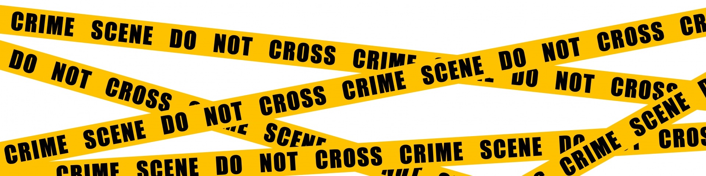

# (PART) Foundations {-}


# The Analyst's Toolbox {#analysts-toolbox}

[Harvey Chapter 1: Introduction to Analytical Chemistry](https://chem.libretexts.org/Bookshelves/Analytical_Chemistry/Book%3A_Analytical_Chemistry_2.1_(Harvey)/01%3A_Introduction_to_Analytical_Chemistry)

## A problem

***A man is found dead in his home with white powder on his upper lip.  Your job as the chief analytical chemist for the state crime lab is to determine how he died.  What should you do?***

<!-- (is this the best example?  is there one that could be solved with tools of genchem/ochem? one that could show "traditional" way of analyzing?) -->

**Responding officers found the following on scene:**

- A small bag with a white powder in it (his roomate was previously arrested for cocaine)
- A bag of powdered-sugar donuts
<!-- - *Datura stramonium* in the backyard garden (which contains the highly-toxic psychoactive drug scopalamine) -->

<!-- **Other Notes:** -->

<!-- - The penalty for possessing cocaine hydrochloride is different from the penalty for possessing the freebase form. -->
<!-- - It is legal to grow *Datura*, despite it's toxic and psychotic natures. -->

<!-- ```{r, echo=FALSE} -->
<!--   -->
<!-- ``` -->

<!-- ## Add some pictures and explanation -->

## The Analyst's Toolbox

<!-- > As we introduce new techniques, it is important that you incorporate them in the context of the techniques with which you are already familair. -->
<!-- > - *Granger, p3* -->

<!-- **Tools of an Analyst:** -->

<!-- - Spectroscopy -->
<!--   - UV-visible (electronic) -->
<!--   - Infrared (vibrational) -->
<!--   - Nuclear Magnetic Resonance (nuclear) -->
<!-- - Spectrometry (mass of molecules/fragments of molecules) -->
<!-- - Chromatography (separations) -->

<!-- ## What is Analytical Chemistry? (vs. Chemical Analysis) -->

<!-- ## Our Goals This Semester -->


<!-- ## Teaching Philosopy (What I expect from you) -->


<!-- ## Front Matter -->

